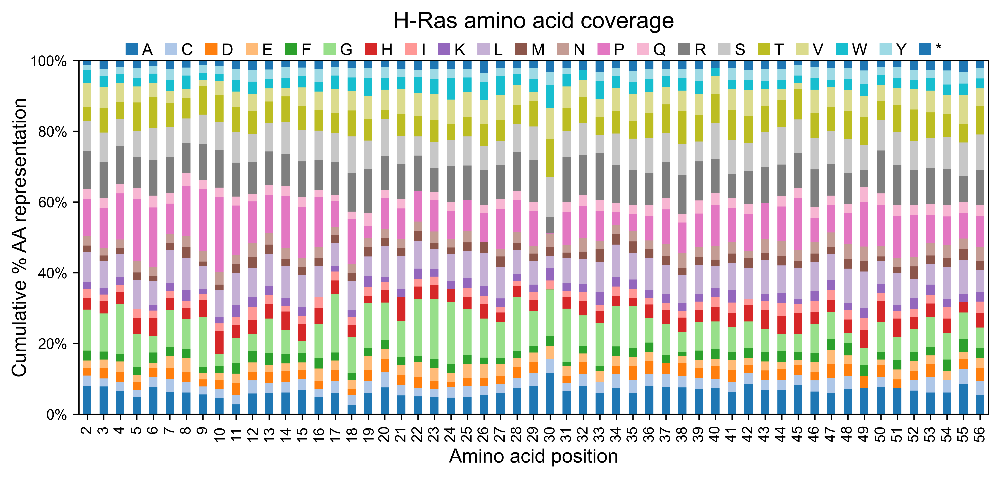
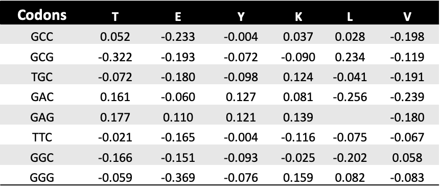
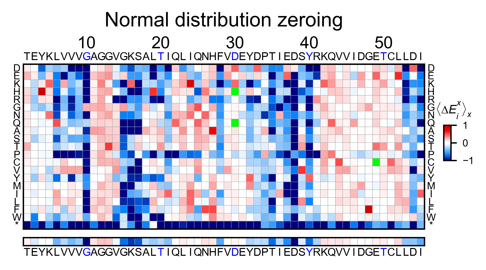
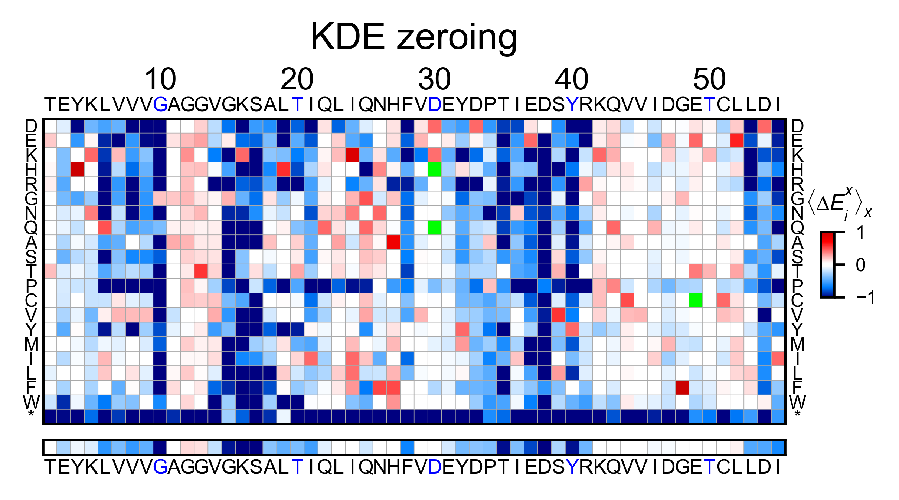

Processing DNA reads
====================

This section will teach you how to use the built-in data muting
functions. If you already have your own muting pipeline built, you can
skip this section and go to the plotting examples.

Import module
-------------

.. code:: ipython3

    %matplotlib inline
    from typing import List
    import numpy as np
    import pandas as pd
    from pandas.core.frame import DataFrame
    from mutagenesis_visualization.main.process_data.count_reads import count_reads
    from mutagenesis_visualization.main.process_data.count_fastq import count_fastq
    from mutagenesis_visualization.main.process_data.calculate_enrichment import calculate_enrichment
    
    from mutagenesis_visualization.main.utils.data_paths import HRAS_FASTQ, HRAS_GAPGEF_COUNTS
    from mutagenesis_visualization.main.classes.counts import Counts
    from mutagenesis_visualization.main.classes.screen import Screen

Count DNA reads from fastq file
-------------------------------

Site saturation mutagenesis
~~~~~~~~~~~~~~~~~~~~~~~~~~~

Methods and functions reviewed in this notebook:
    - :func:`mutagenesis_visualization.main.process_data.count_fastq.count_fastq`
    - :func:`mutagenesis_visualization.main.process_data.count_reads.count_reads`
    - :class:`mutagenesis_visualization.main.classes.counts.Counts`

After sequencing your DNA library, using other packages you will
assemble the forward and reverse reads and trim the flanking bases. That
will produce a trimmed fastq file that contains the DNA reads. This is
where ``mutagenesis_visualization`` kicks in. The following function
``count_reads`` will read your trimmed fastq file and count the number
of times a DNA sequence is present. You will have to pass as inputs a
``dna_sequence`` and a ``codon_list`` with the codons that were used to
make the point mutant library. If ``savefile=True`` , it will export the
results to txt files. Below there is a prettified example of the output
file.

.. code:: ipython3

    # H-Ras dna sequence
    hras_dnasequence: str = 'acggaatataagctggtggtggtgggcgccggcggtgtgggcaagagtgcgctgaccat'\
        + 'ccagctgatccagaaccattttgtggacgaatacgaccccactatagaggattcctaccggaagcaggtgg'\
        + 'tcattgatggggagacgtgcctgttggacatcctg'
    
    # Codons used to make the NNS library. I could also have used 'NNS' and the package will use the NNS codons
    codon_list: List[str] = [
        "GCC", "GCG", "TGC", "GAC", "GAG", "TTC", "GGC", "GGG", "CAC", "ATC", "AAG",
        "CTC", "CTG", "TTG", "ATG", "AAC", "CCC", "CCG", "CAG", "CGC", "CGG", "AGG",
        "TCC", "TCG", "AGC", "ACC", "ACG", "GTC", "GTG", "TGG", "TAC", "TAG"
    ]
    
    counts_wt: bool = False
    start_position: int = 2
    
    # Execute count reads
    df_counts_pre, wt_counts_pre = count_reads(
        hras_dnasequence, HRAS_FASTQ, codon_list, counts_wt, start_position)

.. image:: images/exported_images/hras_tablecounts.png
   :width: 450px
   :align: center

Create object of class ``Counts``.

.. code:: ipython3

    hras_obj = Counts(df_counts_pre, start_position = 2)

Once the reads have been counted, the method ``mean_counts`` can be used
to evaluate the coverage by position. The method
``library_representation`` will tell you the percentage coverage of each
amino acid per position.

.. code:: ipython3

    hras_obj.mean_counts(title='H-Ras mean counts per position')
    
    hras_obj.library_representation(title='H-Ras amino acid coverage')

.. image:: images/exported_images/hras_countspre.png
   :width: 500px
   :align: center
        

Custom DNA list
~~~~~~~~~~~~~~~

Use a custom input DNA list. That way it does not matter if you are
using NNS or you have second order mutations. Create a list of variants
on your own, and the software will count the frequency of each of those
variants on the fastq file you provide as an input. In the example non
of the sequences we are specifying are found in the trimmed file, thus
there are 0% of useful reads.

.. code:: ipython3

    # Create your list of variants
    variants: List[str] = [
        'acggaatataagctggtggtggtgggcgccggcggtgtgggcaagagtgcgctgaccat' +
        'ccagctgatccagaaccattttgtggacgaatacgaccccactatagaggattcctaccggaagcaggtgg' +
        'tcattgatggggagacgtgcctgttggacatcctg',
        'aaaaaatataagctggtggtggtgggcgccggcggtgtgggcaagagtgcgctgaccat' +
        'ccagctgatccagaaccattttgtggacgaatacgaccccactatagaggattcctaccggaagcaggtgg' +
        'tcattgatggggagacgtgcctgttggacatcctg',
        'tttttttataagctggtggtggtgggcgccggcggtgtgggcaagagtgcgctgaccat' +
        'ccagctgatccagaaccattttgtggacgaatacgaccccactatagaggattcctaccggaagcaggtgg' +
        'tcattgatggggagacgtgcctgttggacatcctg'
    ]
    
    variants, totalreads, usefulreads = count_fastq(variants, HRAS_FASTQ)
    
    # Evaluate how many variants in the fastq file were useful
    print(
        '{}/{} useful reads ({}%)'.format(
            str(usefulreads), str(totalreads),
            str(int(usefulreads / totalreads * 100))
        )
    )

Calculate enrichment scores
---------------------------

Methods and functions reviewed in this section:
    - :class:`mutagenesis_visualization.main.classes.screen.Screen`
    - :func:`mutagenesis_visualization.main.process_data.calculate_enrichment.calculate_enrichment`

If you are performing a selection experiment, where you sequence your
library before and after selection, you will need to calculate the
enrichment score of each mutant. The function to do so is
``calculate_enrichment``. This function allows for different parameters
to tune how the data is muted and normalized.

In this example, we show two different ways of using ``calculate_enrichment``. Note that the parameters of choice will have a say on the final result. In the example, the tonality of red of the two heatmaps is slightly different. A more detailed explanation of the parameters can be found in :ref:`Normalizing datasets`.

.. code:: ipython3

    # Read counts from file (could be txt, csv, xlsx, etc...)
    df_counts_pre: DataFrame = pd.read_excel(
        HRAS_GAPGEF_COUNTS,
        'R1_before',
        skiprows=1,
        index_col='Codons',
        usecols='E:FN',
        nrows=32
    )
    
    df_counts_sel: DataFrame = pd.read_excel(
        HRAS_GAPGEF_COUNTS,
        'R1_after',
        skiprows=1,
        index_col='Codons',
        usecols='E:FN',
        nrows=32
    )

.. code:: ipython3

    # Ras parameters to create an object
    
    # Define protein sequence
    hras_sequence: str = 'MTEYKLVVVGAGGVGKSALTIQLIQNHFVDEYDPTIEDSYRKQVVIDGETCLLDILDTAGQEEY'\
                    + 'SAMRDQYMRTGEGFLCVFAINNTKSFEDIHQYREQIKRVKDSDDVPMVLVGNKCDLAARTVES'\
                    + 'RQAQDLARSYGIPYIETSAKTRQGVEDAFYTLVREIRQHKLRKLNPPDESGPG'
    
    # Order of amino acid substitutions in the hras_enrichment dataset
    aminoacids: List[str] = list('ACDEFGHIKLMNPQRSTVWY*')
    
    # First residue of the hras_enrichment dataset. Because 1-Met was not mutated, the dataset starts at residue 2
    start_position: int = 2
    
    # Define secondary structure
    secondary = [['L0'], ['β1'] * (9 - 1), ['L1'] * (15 - 9), ['α1'] * (25 - 15),
                 ['L2'] * (36 - 25), ['β2'] * (46 - 36), ['L3'] * (48 - 46),
                 ['β3'] * (58 - 48), ['L4'] * (64 - 58), ['α2'] * (74 - 64),
                 ['L5'] * (76 - 74), ['β4'] * (83 - 76), ['L6'] * (86 - 83),
                 ['α3'] * (103 - 86), ['L7'] * (110 - 103), ['β5'] * (116 - 110),
                 ['L8'] * (126 - 116), ['α4'] * (137 - 126), ['L9'] * (140 - 137),
                 ['β6'] * (143 - 140), ['L10'] * (151 - 143), ['α5'] * (172 - 151),
                 ['L11'] * (190 - 172)]
    
    # Substitute Nan values with 0
    fillna = 0

.. code:: ipython3

    # Order of amino acids (from count_reads)
    aminoacids_NNS: List[str] = list('AACDEFGGHIKLLLMNPPQRRRSSSTTVVWY*')
    
    # Different parameters can be used to calculate the enrichment scores. They are described in the implementation section
    
    # Zeroing using the median of the population, and not using stop codons to correct.
    frequencies = calculate_enrichment(
        aminoacids=aminoacids_NNS,
        pre_lib=df_counts_pre.iloc[:, :54],
        post_lib=df_counts_sel.iloc[:, :54],
        zeroing_method='population',
        zeroing_metric ='median',
        norm_std=True,
        stopcodon=True,
        min_counts=25,
        min_countswt=100,
        mpop=2,
        mwt=2,
        infinite=3,
        std_scale=0.3
    )
    
    hras_example1 = Screen(
        np.array(frequencies), hras_sequence, aminoacids, start_position, fillna,
        secondary
    )
    
    hras_example1.heatmap(title='Normal distribution zeroing', output_file=None)
    
    # Zeroing using the median of the population, and not using stop codons to correct.
    frequencies = calculate_enrichment(
        aminoacids=aminoacids_NNS,
        pre_lib=df_counts_pre.iloc[:, :54],
        post_lib=df_counts_sel.iloc[:, :54],
        zeroing_method='kernel',
        zeroing_metric ='median',
        norm_std=True,
        stopcodon=True,
        min_counts=25,
        min_countswt=100,
        mpop=2,
        mwt=2,
        infinite=3,
        std_scale=0.15
    )
    
    hras_example2 = Screen(
        np.array(frequencies), hras_sequence, aminoacids, start_position, fillna,
        secondary
    )
    
    hras_example2.heatmap(title='KDE zeroing', output_file=None)
    
    # Note that the two heatmaps look quite similar but the red tonality is slighly different. That is caused by
    # small differences in zeroing the data.

