Normalizing datasets
====================

This section will teach the different options to normalize the data using the function :func:`mutagenesis_visualization.calculate_enrichment` .

If you already have your own processing pipeline built, you can skip this section and go to the (:ref:`Creating plots`) examples.

Import modules and load data
----------------------------

.. code:: ipython3

    %matplotlib inline
    from typing import List, Dict
    import numpy as np
    import pandas as pd
    from pandas.core.frame import DataFrame
    
    from mutagenesis_visualization import calculate_enrichment
    from mutagenesis_visualization.main.utils.data_paths import HRAS_RBD_COUNTS
    from mutagenesis_visualization import Screen

Now let’s add some information about Ras.

.. code:: ipython3

    # Define protein sequence
    hras_sequence: str = 'MTEYKLVVVGAGGVGKSALTIQLIQNHFVDEYDPTIEDSYRKQVVIDGETCLLDILDTAGQEEY'\
                    + 'SAMRDQYMRTGEGFLCVFAINNTKSFEDIHQYREQIKRVKDSDDVPMVLVGNKCDLAARTVES'\
                    + 'RQAQDLARSYGIPYIETSAKTRQGVEDAFYTLVREIRQHKLRKLNPPDESGPG'
    
    
    # First residue of the hras_enrichment dataset. Because 1-Met was not mutated, the dataset starts at residue 2
    start_position: int = 2
    
    # Substitute Nan values with 0
    fillna: int = 0

.. code:: ipython3

    # List of sheets and columns to use
    sheets_pre: List[str] = ['R1_before', 'R2_before', 'R3_before']
    sheets_sel: List[str] = ['R1_after', 'R2_after', 'R3_after']
    columns: List[str] = ['F:BG', 'BH:DK', 'DL:FN']
    columns_wt: List[str] = ['A', 'B', 'C']
    
    # Create dictionary with data. Loading 3 replicates, each of them is divided into 3 pools
    dict_pre, dict_sel, dict_pre_wt, dict_sel_wt = ({} for i in range(4))
    
    # Read counts from file (could be txt, csv, xlsx, etc...)
    for column, column_wt in zip(columns, columns_wt):
        for sheet_pre, sheet_sel in zip(sheets_pre, sheets_sel):
            # Pre counts
            label_pre = str(sheet_pre + '_' + column_wt)
            dict_pre[label_pre] = pd.read_excel(
                HRAS_RBD_COUNTS, sheet_pre, skiprows=1, usecols=column, nrows=32
            )
            # Pre counts wild-type alleles
            dict_pre_wt[label_pre] = pd.read_excel(
                HRAS_RBD_COUNTS, sheet_pre, usecols=column_wt
            )
    
            # Sel counts
            label_sel = str(sheet_sel + '_' + column_wt)
            dict_sel[label_sel] = pd.read_excel(
                HRAS_RBD_COUNTS, sheet_sel, skiprows=1, usecols=column, nrows=32
            )
            # Sel counts wild-type alleles
            dict_sel_wt[label_sel] = pd.read_excel(
                HRAS_RBD_COUNTS, sheet_sel, usecols=column_wt
            )

Calculate log10 enrichment
--------------------------

Now we are going to calculate the log10(sel/pre) for the sublibrary 1 of
each replicate and plot a histogram. The resulting distribution is
bimodal, and because the three replicates have a similar number of
counts ratios, their center is overlapping. However, because we have not
normalized by the number of counts, and there are more counts in the
selected than in the pre-selected population, the center is >0.

.. code:: ipython3

    # Auxiliar function to convert +-inf values to an arbitrary number (ie +-2)
    def _replace_inf(df: DataFrame) -> DataFrame:
        df.replace(to_replace=np.inf, value=2, inplace=True)
        df.replace(to_replace=-np.inf, value=-2, inplace=True)
        return df
    
    
    aminoacids: List[str] = list('AACDEFGGHIKLLLMNPPQRRRSSSTTVVWY*')
    enrichment = {}
    
    # calculate log10 enrichment for each replicate
    for pre_key, sel_key in zip(list(dict_pre.keys())[:3],
                                list(dict_sel.keys())[:3]):
        # log 10
        enrichment_log10 = (np.log10(dict_sel[sel_key] / dict_pre[pre_key]))
        enrichment_log10['aminoacids'] = aminoacids
        enrichment_log10.set_index(['aminoacids'], inplace=True)
        enrichment[pre_key[:2]] = _replace_inf(enrichment_log10)
    
    # Create objects
    hras_object: Screen = Screen(
        list(enrichment.values()), hras_sequence, aminoacids, start_position, fillna,
    )
    
    hras_object.kernel(show_replicates=True, kernel_color_replicates = ["b", "r", "g"], title=r'$log_{10}$' + '(sel/pre)', xscale=(-1, 1))

.. image:: images/exported_images/hras_kdesub1.png
   :width: 350px
   :align: center

Centering the data (zeroing)
----------------------------

Functions used in this section:
    - :class:`mutagenesis_visualization.main.kernel.kernel.Kernel`
    - :func:`mutagenesis_visualization.calculate_enrichment`

Counts normalization
~~~~~~~~~~~~~~~~~~~~

Normalizing by the number of counts improves normalization. Now the
population center is closer to 0. To do so, set
``zeroing_method='counts'``.

.. code:: ipython3

    enrichment = {}
    aminoacids: List[str] = list('AACDEFGGHIKLLLMNPPQRRRSSSTTVVWY*')
    # calculate log10 enrichment for each replicate
    for pre_key, sel_key in zip(list(dict_pre.keys())[:3],
                                list(dict_sel.keys())[:3]):
        # Enrichment
        enrichment[pre_key[:2]] = calculate_enrichment(
            aminoacids, dict_pre[pre_key], dict_sel[sel_key], zeroing_method='counts', stopcodon=False
        )
    
    # Plot histogram and KDE
    aminoacids: List[str] = list('ACDEFGHIKLMNPQRSTVWY*')
    
    hras_object: Screen = Screen(
        list(enrichment.values()), hras_sequence, aminoacids, start_position, fillna,
    )
    
    hras_object.kernel(show_replicates=True, kernel_color_replicates = ["b", "r", "g"], title='zeroing_method = counts', xscale=(-1, 0.5))

.. image:: images/exported_images/hras_zeroingcounts.png
   :width: 350px
   :align: center

Wt allele
~~~~~~~~~

Another way we can normalize is by using an internal reference such as a
particular mutant. In the following example we will use the wild-type
allele. If the assay that you are using is noisy, relying on a single
data point for normalizing will result in high variance. The package
does not include this option because it may lead to errors. Here we are
showing how it would be done by hand. In this example, it works fine.
But in other datasets we have, it has been a source of error.

.. code:: ipython3

    # calculate log10 enrichment for each replicate
    
    aminoacids: List[str] = list('AACDEFGGHIKLLLMNPPQRRRSSSTTVVWY*')
    enrichment = {}
    
    # calculate log10 enrichment for each replicate
    for pre_key, sel_key in zip(list(dict_pre.keys())[:3],
                                list(dict_sel.keys())[:3]):
        # log 10
        wt_ratio = np.log10(
            dict_sel_wt[sel_key]['wt 2-56'][1] / dict_pre_wt[pre_key]['wt 2-56'][1]
        )
        enrichment_log10 = np.log10(
            dict_sel[sel_key] / dict_pre[pre_key]
        ) - wt_ratio
        enrichment_log10['aminoacids'] = aminoacids
        enrichment_log10.set_index(['aminoacids'], inplace=True)
        enrichment[pre_key[:2]] = _replace_inf(enrichment_log10)
    
    hras_object: Screen = Screen(
        list(enrichment.values()), hras_sequence, aminoacids, start_position, fillna,
    )
    hras_object.kernel(show_replicates=True, kernel_color_replicates = ["b", "r", "g"], title='zeroing_method = wt allele only', xscale=(-0.5, 0.5))

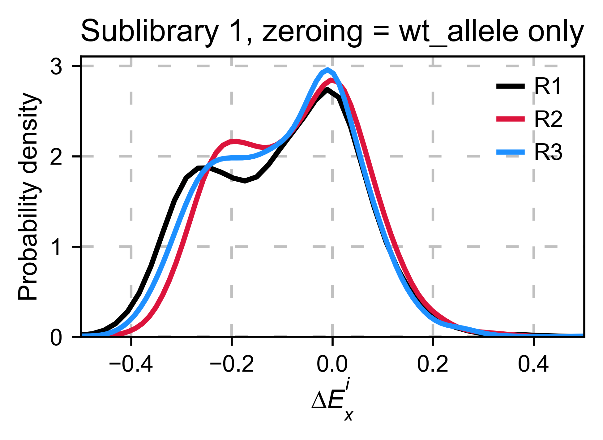

Distribution of synonymous wt alleles
~~~~~~~~~~~~~~~~~~~~~~~~~~~~~~~~~~~~~

In our experience, it is better to use the median/mode/mean of the
synonymous wild-type population because there is less variance.
``calculate_enrichment`` has such an options by using
``zeroing_method='wt'`` and then
``zeroing_metric ='median', 'mean' or 'mode'``.

.. code:: ipython3

    enrichment = {}
    aminoacids: List[str] = list('AACDEFGGHIKLLLMNPPQRRRSSSTTVVWY*')
    
    # calculate log10 enrichment for each replicate
    for pre_key, sel_key in zip(list(dict_pre.keys())[:3],
                                list(dict_sel.keys())[:3]):
        # Enrichment
        enrichment[pre_key[:2]] = calculate_enrichment(
            aminoacids,
            dict_pre[pre_key],
            dict_sel[sel_key],
            dict_pre_wt[pre_key],
            dict_sel_wt[sel_key],
            zeroing_method='wt',
            zeroing_metric ='mode',
            stopcodon=False
        )
    
    aminoacids: List[str] = list('ACDEFGHIKLMNPQRSTVWY*')
    
    hras_object: Screen = Screen(
        list(enrichment.values()), hras_sequence, aminoacids, start_position, fillna,
    )
    hras_object.kernel(show_replicates=True, title='Sublibrary 1, zeroing_method = wt', xscale=(-1.5, 1))

.. image:: images/exported_images/hras_zeroingwtpop.png
   :width: 350px
   :align: center

Wt alleles observation
~~~~~~~~~~~~~~~~~~~~~~

If the population of synonymous wild-type alleles (alleles that are
wild-type at a protein level, but not at a DNA level) is small, the
distribution of this variants may have high variance from sample to
sample. Also, you will notice that not all wild-type alleles are
neutral. The spread of these alleles gives a sense of the noise in the
experiment.

At least for the following data, there is no correlation between the
performance of wild-type alleles in different replicates, suggesting
that the higher or lower enrichment scores are caused by noise and not a
fitness difference caused by changes in protein expression.

.. code:: ipython3

    hras_object.kernel(show_replicates=True, wt_counts_only=True,title='Wild-type alleles', kernel_colors=['k', 'crimson', 'dodgerblue', 'g', 'silver'], xscale=(-0.5, 1), output_file="docs/images/exported_images/hras_wildtype_distribution.png")

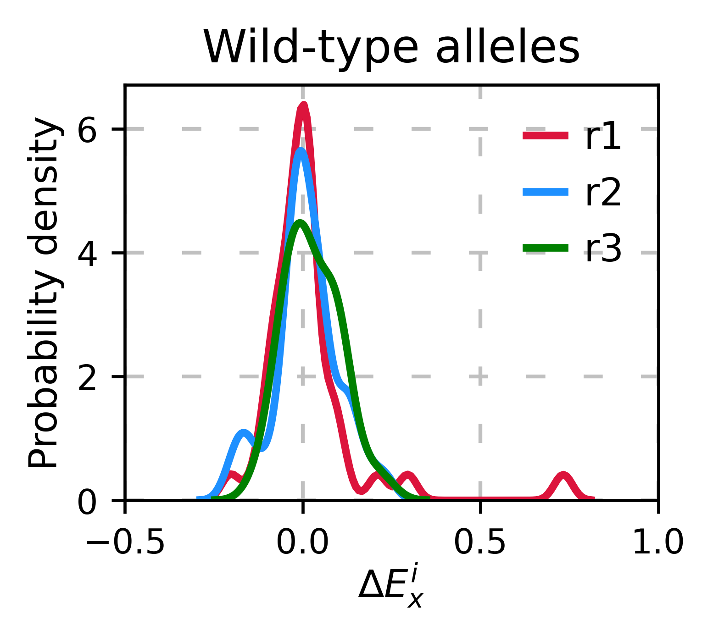

Perform the scatter plots:

.. code:: ipython3

    hras_object.scatter_replicates(wt_counts_only=True,title='Wild-type alleles', xscale=(-1, 1), yscale=(-1, 1), output_file="docs/images/exported_images/hras_wildtype_scatter.png")

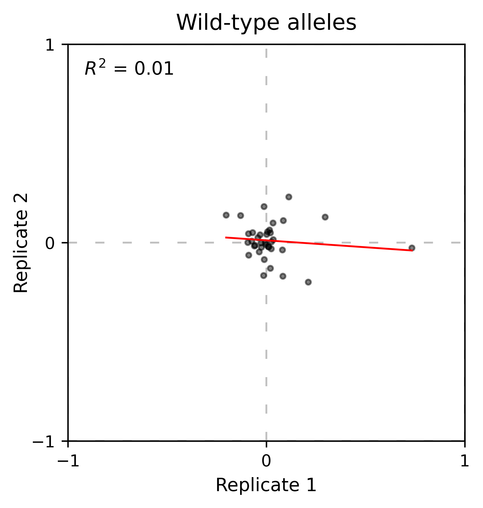

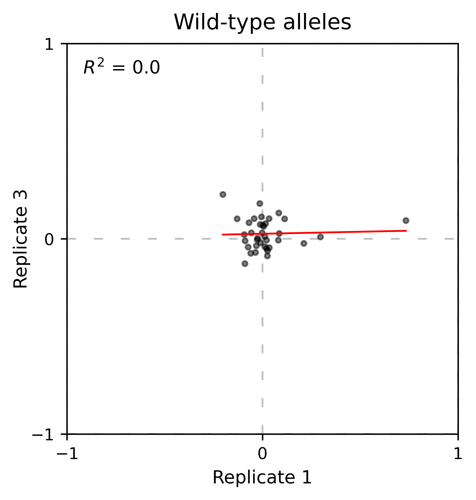

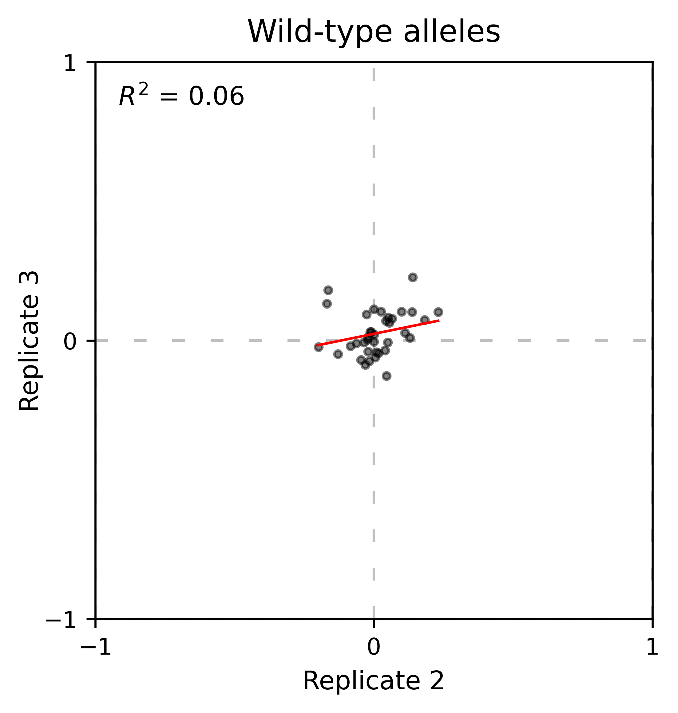

Distribution of mutants
~~~~~~~~~~~~~~~~~~~~~~~

An alternative option to normalize the data is to use the
mean/median/mode of the population to some specific number such as zero.
To do so, use ``zeroing_method='population'``. The parameters of the
distribution will be calculated assuming a gaussian distribution. Not
only the three replicates are centered, but also they have the same
spread.

.. code:: ipython3

    enrichment = {}
    aminoacids: List[str] = list('AACDEFGGHIKLLLMNPPQRRRSSSTTVVWY*')
    
    # calculate log10 enrichment for each replicate
    for pre_key, sel_key in zip(list(dict_pre.keys())[:3],
                                list(dict_sel.keys())[:3]):
        # Enrichment
        enrichment[pre_key[:2]]  = calculate_enrichment(
            aminoacids,
            dict_pre[pre_key],
            dict_sel[sel_key],
            zeroing_method='population',
            zeroing_metric ='mode',
            stopcodon=False
        )
    
    aminoacids: List[str] = list('ACDEFGHIKLMNPQRSTVWY*')
    
    hras_object: Screen = Screen(
        list(enrichment.values()), hras_sequence, aminoacids, start_position, fillna,
    )
    hras_object.kernel(show_replicates=True, title='zeroing_method = population', xscale=(-1, 1))

.. image:: images/exported_images/hras_zeroingpopulation.png
   :width: 350px
   :align: center

A variant of the previous method is to calculate the kernel density
estimate using ``zeroing_method='kernel'``. This option centers the
population using the mode of the KDE. If the data is bimodal, it will
select the main peak. Furthermore, it will use the standard deviation of
the main peak to scale the data. This method is useful when you have
split your library into multiple pools because it will not only center
the data properly but also do scale the data so each pool main peak has
the same standard deviation. Results are quite similar to setting
``zeroing_method='population'`` and ``zeroing_metric ='mode'``.

.. code:: ipython3

    enrichment = {}
    aminoacids: List[str] = list('AACDEFGGHIKLLLMNPPQRRRSSSTTVVWY*')
    
    # calculate log10 enrichment for each replicate
    for pre_key, sel_key in zip(list(dict_pre.keys())[:3],
                                list(dict_sel.keys())[:3]):
        # Enrichment
        enrichment[pre_key[:2]] = calculate_enrichment(
            aminoacids, dict_pre[pre_key], dict_sel[sel_key], zeroing_method='kernel', stopcodon=False
        )
    
    aminoacids: List[str] = list('ACDEFGHIKLMNPQRSTVWY*')
    
    hras_object: Screen = Screen(
        list(enrichment.values()), hras_sequence, aminoacids, start_position, fillna,
    )
    hras_object.kernel(show_replicates=True, kernel_color_replicates = ["b", "r", "g"],  title='zeroing method = kernel', xscale=(-1.5,1))

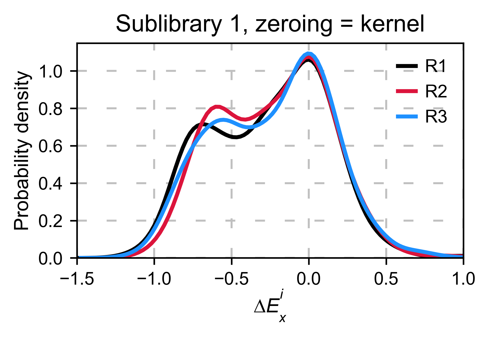

Baseline subtraction
--------------------

Including stop codons in the library can be of great use because it
gives a control for basal signal in your assay. The algorithm has the
option to apply a baseline subtraction. The way it works is it sets the
stop codons counts of the selected population to 0 (baseline) and
subtracts the the baseline signal to every other mutant. To use this
option, set ``stopcodon=True``. You will notice that it get rids of the
shoulder peak, and now the distribution looks unimodal with a big left
shoulder.

.. code:: ipython3

    enrichment = {}
    aminoacids: List[str] = list('AACDEFGGHIKLLLMNPPQRRRSSSTTVVWY*')
    
    # calculate log10 enrichment for each replicate
    for pre_key, sel_key in zip(list(dict_pre.keys())[:3],
                                list(dict_sel.keys())[:3]):
        # Enrichment
        enrichment[pre_key[:2]] = calculate_enrichment(
            aminoacids, dict_pre[pre_key], dict_sel[sel_key], zeroing_method='kernel', stopcodon=True
        )
    
    aminoacids: List[str] = list('ACDEFGHIKLMNPQRSTVWY*')
    
    hras_object: Screen = Screen(
        list(enrichment.values()), hras_sequence, aminoacids, start_position, fillna,
    )
    hras_object.kernel(show_replicates=True, kernel_color_replicates = ["b", "r", "g"], title='stop codon correction', xscale=(-5, 1.5))

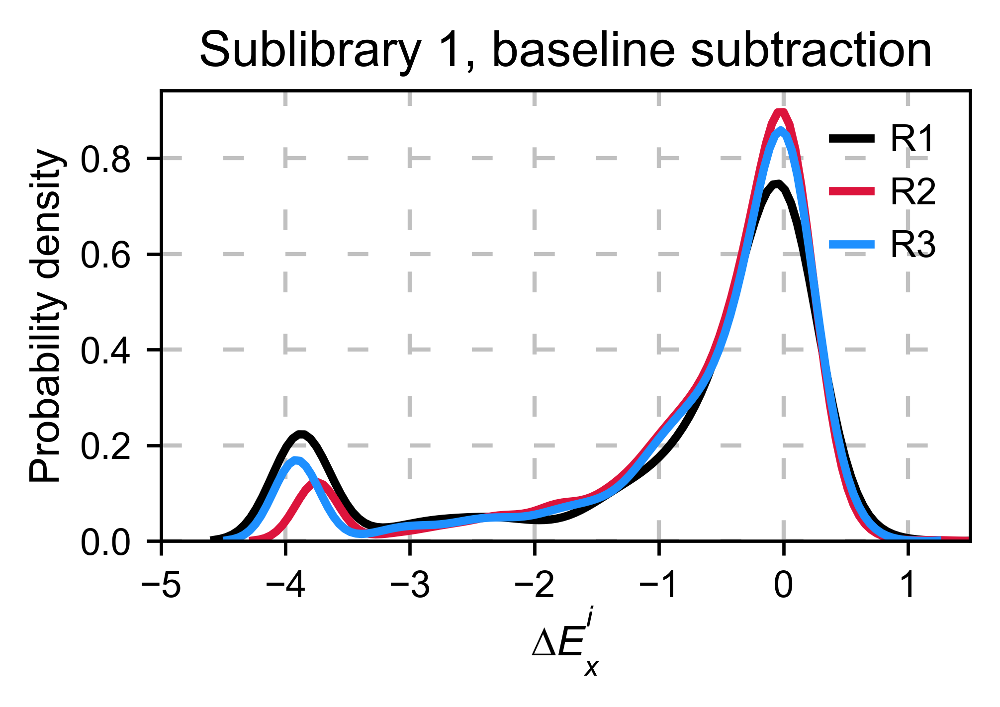

Scaling
-------

By now you probably have realized that different options of
normalization affect to the spread of the data. The rank between each
mutant is unchanged between the different methods, so it is a matter of
multiplying/dividing by a scalar to adjust the data spread. Changing the
value of the parameter ``std_scale`` will do the job. You will probably
do some trial an error until you find the right value. In the following
example we are changing the ``std_scale`` parameter for each of the
three replicates shown. Note that the higher the scalar, the higher the
spread.

.. code:: ipython3

    enrichment_scalar = {}
    scalars: List[str] = [0.1, 0.2, 0.3]
    aminoacids: List[str] = list('AACDEFGGHIKLLLMNPPQRRRSSSTTVVWY*')
    
    # calculate log10 enrichment for each replicate
    for pre_key, sel_key, scalar in zip(list(dict_pre.keys())[:3],
                                        list(dict_sel.keys())[:3], scalars):
        # Enrichment
        enrichment_log10 = calculate_enrichment(
            aminoacids,
            dict_pre[pre_key],
            dict_sel[sel_key],
            zeroing_method='kernel',
            stopcodon=True,
            std_scale=scalar
        )
        enrichment_scalar[pre_key[:2]] = enrichment_log10
    
    
    aminoacids: List[str] = list('ACDEFGHIKLMNPQRSTVWY*')
    
    hras_object: Screen = Screen(
        list(enrichment_scalar.values()), hras_sequence, aminoacids, start_position, fillna,
    )
    hras_object.kernel(show_replicates=True, kernel_color_replicates = ["b", "r", "g"], title='scaling', xscale=(-5, 1.5))

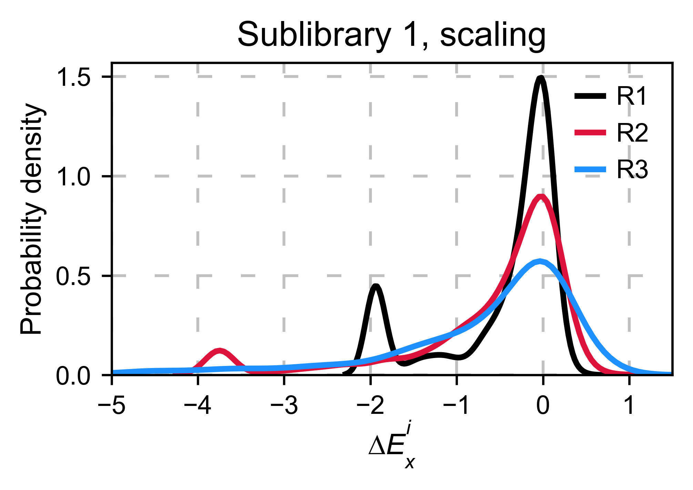

Multiple sublibraries
---------------------

In our own research projects, where we have multiple DNA pools, we have
determined that the combination of parameters that best suit us it to
the wild-type synonymous sequences to do a first data normalization
step. Then use ``zeroing_method = 'kernel'`` to zero the data and use
``stopcodon=True`` in order to determine the baseline level of signal.
You may need to use different parameters for your purposes. Feel free to
get in touch if you have questions regarding data normalization.

.. code:: ipython3

    # Labels
    labels: List[str] = ['Sublibrary 1', 'Sublibrary 2', 'Sublibrary 3']
    zeroing_options: List[str] = ['population', 'counts', 'wt', 'kernel']
    title: str = 'Rep-A sublibraries, zeroing_method = '
    
    # xscale
    xscales = [(-2, 1), (-2.5, 0.5), (-3.5, 1.5), (-3.5, 1.5)]
    # declare dictionary
    enrichment_lib = {}
    df_lib = {}
    
    for option, xscale in zip(zeroing_options, xscales):
        for pre_key, sel_key, label in zip(list(dict_pre.keys())[::3],
                                           list(dict_sel.keys())[::3], labels):
            aminoacids: List[str] = list('AACDEFGGHIKLLLMNPPQRRRSSSTTVVWY*')
    
            # log 10
            enrichment_lib[label]  = DataFrame(calculate_enrichment(
                aminoacids,
                dict_pre[pre_key],
                dict_sel[sel_key],
                dict_pre_wt[pre_key],
                dict_sel_wt[sel_key],
                zeroing_method=option,
                zeroing_metric ='mode',
                stopcodon=True,
                infinite=2
            ))
    
        # Concatenate sublibraries and store in dict
        df_lib[option] = pd.concat([
            enrichment_lib['Sublibrary 1'], enrichment_lib['Sublibrary 2'],
            enrichment_lib['Sublibrary 3']
        ],ignore_index=True, axis=1)
    
    
        # Plot
        aminoacids: List[str] = list('ACDEFGHIKLMNPQRSTVWY*')
    
        hras_sublibrary1: Screen = Screen(
            enrichment_lib['Sublibrary 1'], hras_sequence, aminoacids, start_position, fillna,
        )
        hras_sublibrary2: Screen = Screen(
            enrichment_lib['Sublibrary 2'], hras_sequence, aminoacids, start_position, fillna,
        )
        hras_sublibrary3: Screen = Screen(
            enrichment_lib['Sublibrary 3'], hras_sequence, aminoacids, start_position, fillna,
        )
        hras_sublibrary1.multiple_kernel([hras_sublibrary2, hras_sublibrary3], label_kernels = labels, title=title + option, xscale=xscale)

.. image:: images/exported_images/hras_repA_zeroingpopulation.png
   :width: 350px

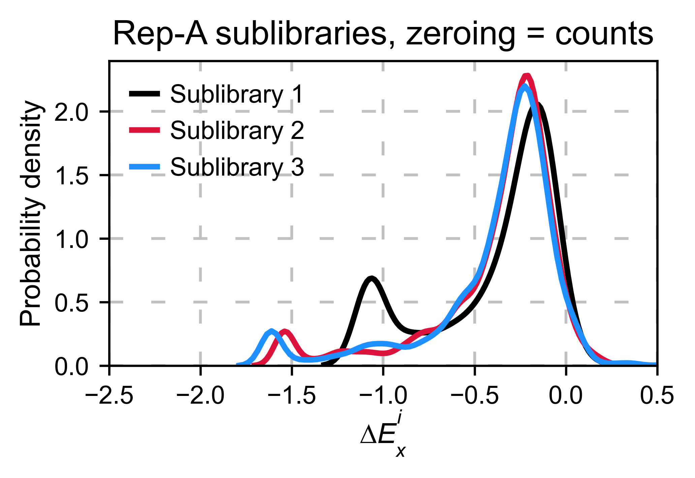
   
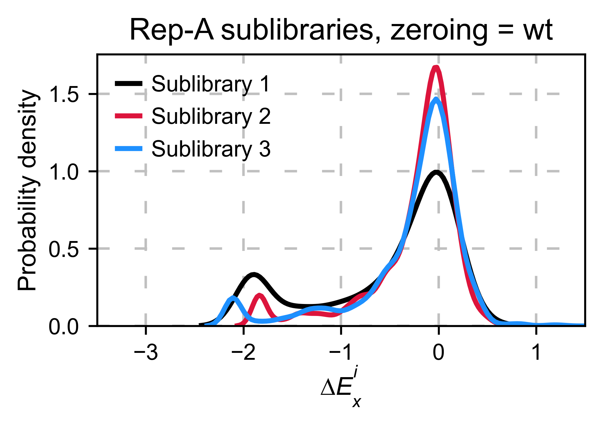
   
.. image:: images/exported_images/hras_repA_zeroingkernel.png
   :width: 350px

Heatmaps
--------

Function and class used in this section:
    - :class:`mutagenesis_visualization.Screen`
    - :meth:`mutagenesis_visualization.main.heatmaps.heatmap.Heatmap`

We are going to evaluate how does the heatmap of produced by each of the
normalization methods. We are not going to scale the data, so some
heatmaps may look more washed out than others. That is not an issue
since can easily be changed by using ``std_scale``.

.. code:: ipython3

    # First we need to create the objects
    
    # Define protein sequence
    hras_sequence: str = 'MTEYKLVVVGAGGVGKSALTIQLIQNHFVDEYDPTIEDSYRKQVVIDGETCLLDILDTAGQEEY'\
                    + 'SAMRDQYMRTGEGFLCVFAINNTKSFEDIHQYREQIKRVKDSDDVPMVLVGNKCDLAARTVES'\
                    + 'RQAQDLARSYGIPYIETSAKTRQGVEDAFYTLVREIRQHKLRKLNPPDESGPG'
    
    # Order of amino acid substitutions in the hras_enrichment dataset
    aminoacids: List[str] = list('ACDEFGHIKLMNPQRSTVWY*')
    
    # First residue of the hras_enrichment dataset. Because 1-Met was not mutated, the dataset starts at residue 2
    start_position: int = 2
    
    # Create objects
    objects: Dict[str, Screen] = {}
    for key, value in df_lib.items():
        temp = Screen(value, hras_sequence, aminoacids, start_position)
        objects[key] = temp

Now that the objects are created and stored in a dictionary, we will use
the method ``object.heatmap``. You will note that the first heatmap
(“population”) looks a bit washed out. If you look at the kernel
distribution, the spread is smaller. The “kernel” and “wt” heatmaps look
almost identical, while the “counts” heatmap looks all blue. This is
caused by the algorithm not being able to center the data properly, and
everything seems to be loss of function. That is why it is important to
select the method of normalization that works with your data.

.. code:: ipython3

    titles: List[str] = ['population', 'counts', 'wt', 'kernel']
    
    # Create objects
    for obj, title in zip(objects.values(), titles):
        obj.heatmap(title='Normalization by ' + title + ' method')

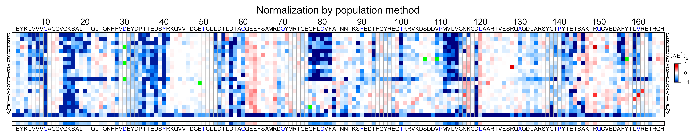

.. image:: images/exported_images/hras_heatmap_norm_counts.png
   
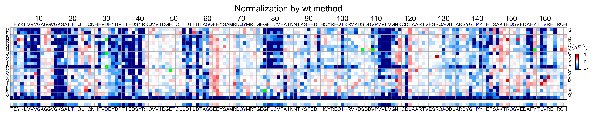
   
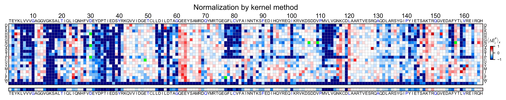

