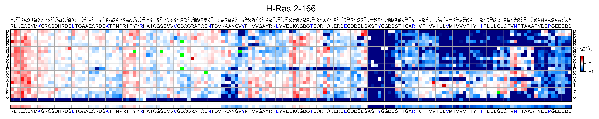
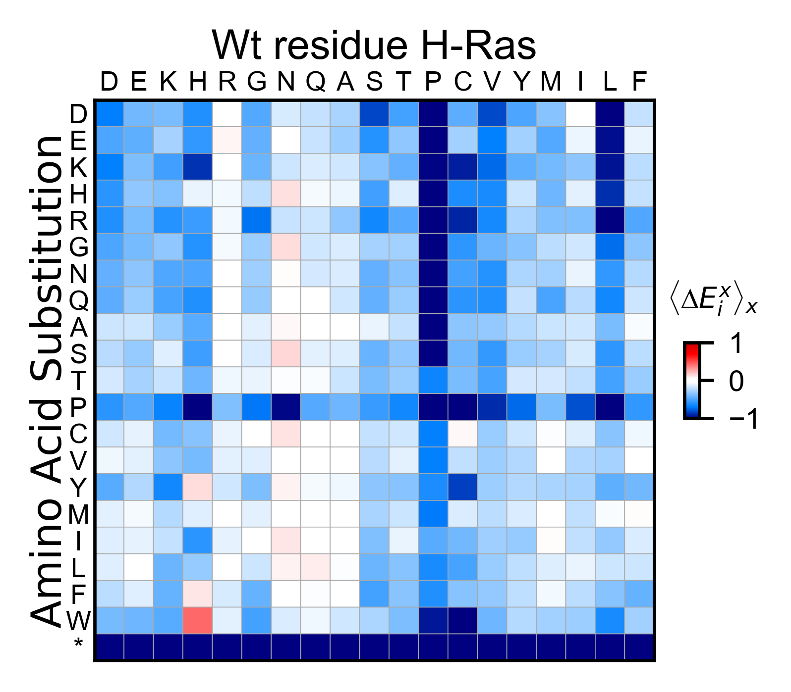
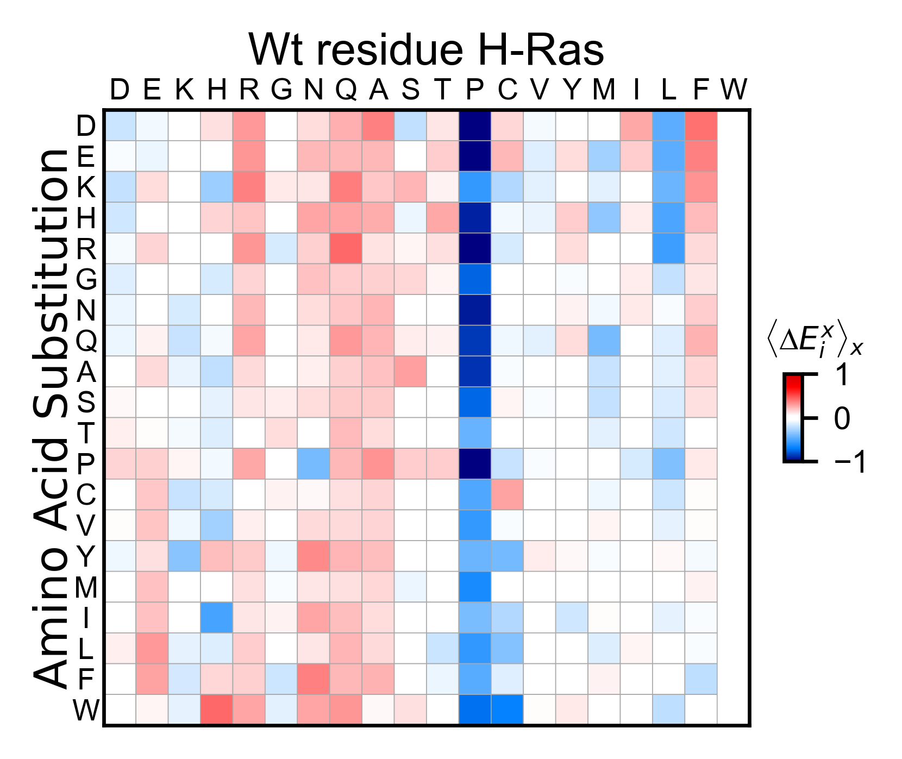

Creating heatmaps
=================

This section shows how to use the mutagenesis_visualization package. The plotting functions can be used regardless of how you process your data. For the examples, we are using two datasets that are derived from Pradeep’s legacy. [#Pradeep2017]_

Import modules
--------------

.. code:: python

    # running locally, if you pip install then you just have to import the module
    from typing import List
    import numpy as np
    import matplotlib as plt
    import copy
    from mutagenesis_visualization.main.classes.screen import Screen
    from mutagenesis_visualization.main.utils.data_paths import HRAS_RBD_COUNTS_CSV, HRAS_RBD_COUNTS_CSV

Create object of class Screen
-----------------------------

Class reviewed in this section:
    - :class:`mutagenesis_visualization.Screen`

In order to create plots, the first step is to create a
``Screen.object``. The enrichment scores will be passed using the
parameter ``dataset`` . The protein sequence ``sequence`` and the amino
acid substitutions order ``aminoacids`` need to be defined for the
object to be created. Adding the secondary structure ``secondary`` is
optional, but without it some plots will not work. In this example, we
are importing two datasets and creating two objects named
``hras_GAPGEF`` and ``hras_RBD``.

.. code:: python

    # Load enrichment scores. This is how you would load them from a local file.
    hras_enrichment_GAPGEF = np.genfromtxt(HRAS_GAPGEF_COUNTS_CSV, delimiter=',')
    hras_enrichment_RBD = np.genfromtxt(HRAS_RBD_COUNTS_CSV, delimiter=',')
    
    # Define protein sequence
    hras_sequence: str = 'MTEYKLVVVGAGGVGKSALTIQLIQNHFVDEYDPTIEDSYRKQVVIDGETCLLDILDTAGQEEY'\
                    + 'SAMRDQYMRTGEGFLCVFAINNTKSFEDIHQYREQIKRVKDSDDVPMVLVGNKCDLAARTVES'\
                    + 'RQAQDLARSYGIPYIETSAKTRQGVEDAFYTLVREIRQHKLRKLNPPDESGPG'
    
    # Order of amino acid substitutions in the hras_enrichment dataset
    aminoacids: List[str] = list('ACDEFGHIKLMNPQRSTVWY*')
    
    # First residue of the hras_enrichment dataset. Because 1-Met was not mutated, the dataset starts at residue 2
    start_position: int = 2
    
    # Define secondary structure
    secondary = [['L0'], ['β1'] * (9 - 1), ['L1'] * (15 - 9), ['α1'] * (25 - 15),
                 ['L2'] * (36 - 25), ['β2'] * (46 - 36), ['L3'] * (48 - 46),
                 ['β3'] * (58 - 48), ['L4'] * (64 - 58), ['α2'] * (74 - 64),
                 ['L5'] * (76 - 74), ['β4'] * (83 - 76), ['L6'] * (86 - 83),
                 ['α3'] * (103 - 86), ['L7'] * (110 - 103), ['β5'] * (116 - 110),
                 ['L8'] * (126 - 116), ['α4'] * (137 - 126), ['L9'] * (140 - 137),
                 ['β6'] * (143 - 140), ['L10'] * (151 - 143), ['α5'] * (172 - 151),
                 ['L11'] * (190 - 172)]
    
    # Substitute Nan values with 0
    fillna: int = 0
    
    # Create objects
    hras_GAPGEF: Screen = Screen(
        hras_enrichment_GAPGEF, hras_sequence, aminoacids, start_position, fillna,
        secondary
    )
    hras_RBD: Screen = Screen(
        hras_enrichment_RBD, hras_sequence, aminoacids, start_position, fillna,
        secondary
    )

Heatmaps
--------

Methods reviewed in this section:
    - :meth:`mutagenesis_visualization.Screen.heatmap`
    - :meth:`mutagenesis_visualization.Screen.heatmap_rows`
    - :meth:`mutagenesis_visualization.Screen.heatmap_columns`
    - :meth:`mutagenesis_visualization.Screen.miniheatmap`

Once the object ``hras_RBD`` is created, we will plot a heatmap of the
enrichment scores using the method ``object.heatmap``.

.. code:: python

    # Create full heatmap
    hras_RBD.heatmap(title='H-Ras 2-166', show_cartoon=True)

.. image:: images/exported_images/hras_fullheatmap.png

If you set the parameter ``hierarchical=True``, it will sort the columns
using hierarchical clustering

.. code:: python

    hras_RBD.heatmap(title='H-Ras 2-166', hierarchical=True, output_file=None)

You can change the scale and the color map using the parameters
``colorbar_scale`` and ``colormap``.

.. code:: python

    # Load a color map from matplotlib
    colormap = copy.copy((plt.cm.get_cmap('PuOr')))
    
    # Change scale and colormap
    hras_RBD.heatmap(
        title='H-Ras 2-166',
        colorbar_scale=(-2, 2),
        colormap=colormap,
        show_cartoon=True,
    )

.. image:: images/exported_images/hras_fullheatmap_colormap.png

If you set the parameter ``show_snv=True``, the algorithm will color
green every mutation that is not a single nucleotide variant (SNV) of
the wild-type protein. You will notice how many mutations are not
accessible through a nucleotide change. This option may be useful to you
so you can quickly evaluate which mutations are accessible through
random DNA mutations. In the example of Ras, the frequency of non-SNV
substitutions at residues 12 and 13 is dramatically lower.

.. code:: python

    # Create full heatmap showing only SNV mutants
    hras_RBD.heatmap(
        title='H-Ras 2-166', show_cartoon=True, show_snv=True)

.. image:: images/exported_images/hras_fullheatmap_snv.png

We can slice the full heatmap by either showing only some columns or
some rows. To show only a few amino acid mutational profiles (rows), we
will use the method ``object.heatmap_rows``. Note that we need to
specify which amino acids to show with ``selection``.

Heatmap slices
--------------

.. code:: python

    # Create heatmap of selected aminoacid substitutions
    hras_RBD.heatmap_rows(
        title='H-Ras 2-166',
        selection=['E', 'Q', 'A', 'P', 'V', 'Y'],
    )

.. image:: images/exported_images/hras_selectionheatmap.png

If we want to display only a few positions in the protein (columns), we
will use the method ``object.heatmap_columns``. The parameter
``segment`` will indicate which are the contigous columns to show.

.. code:: python

    # Create a heatmap of a subset region in the protein
    hras_RBD.heatmap_columns(segment=[20, 40])

.. image:: images/exported_images/hras_subsetheatmap.png
   :width: 200px
   :align: center

Miniheamap
----------

A summarized heatmap can also be generated. It is useful to evaluate
global trends in the data. The command to use is ``object.miniheatmap``.

.. code:: python

    # Condensed heatmap
    hras_RBD.miniheatmap(title='Wt residue H-Ras')

.. image:: images/exported_images/hras_miniheatmap.png
   :width: 250px
   :align: center

Now lets look at the effect of having a certain residue in front the
mutated residue. For instance, the column of prolines is the average of
all the columns that had a proline in the n-1 position. To accomplish
this, ``set offset=-1``.

.. code:: python

    # Condensed heatmap offset no background correction
    hras_RBD.miniheatmap(
        title='Wt residue H-Ras',
        offset=-1,
        background_correction=False,
    )

Now lets do a background correction by setting
``background_correction=True``. To the calculated values, it will
subtract the mean enrichment score for every substitution type. In the
example, proline is the only residues than wen situated before the
mutation, it seems to have a detrimental effect.

.. code:: python

    # Condensed heatmap offset with background correction
    hras_RBD.miniheatmap(
        title='Wt residue H-Ras',
        offset=-1,
        background_correction=True,
    )

Reference
---------

.. [#Pradeep2017] Bandaru, P., Shah, N. H., Bhattacharyya, M., Barton, J. P., Kondo, Y., Cofsky, J. C., … Kuriyan, J. (2017). Deconstruction of the Ras switching cycle through saturation mutagenesis. ELife, 6. `DOI: 10.7554/eLife.27810  <https://elifesciences.org/articles/27810>`_
