Creating plots
==============

This section continues showing how to do different types of plots.

Import modules
--------------

.. code:: ipython3

    # running locally, if you pip install then you just have to import the module
    %matplotlib inline
    from pandas.core.frame import DataFrame
    import numpy as np
    import pandas as pd
    from mutagenesis_visualization.main.demo.demo_objects import DemoObjects
    DEMO_OBJECTS:DemoObjects = DemoObjects()
    hras_rbd = DEMO_OBJECTS.hras_rbd
    hras_gapgef = DEMO_OBJECTS.hras_gapgef

Histogram, scatter and more
---------------------------

Classes reviewed in this section:
    - :class:`mutagenesis_visualization.main.kernel.kernel.Kernel`
    - :class:`mutagenesis_visualization.main.kernel.histogram.Histogram`
    - :class:`mutagenesis_visualization.main.scatter.scatter.Scatter`
    - :class:`mutagenesis_visualization.main.other_stats.rank.Rank`
    - :class:`mutagenesis_visualization.main.other_stats.cumulative.Cumulative`

There are different tools to analyze the data. The package can plot the
kernel density estimation (``object.kernel``). There is the option to
fit other functions to the data (see Implementation for more). You could
also only plot a histogram (``object.histogram``). For the histograms,
we can select to plot only the single nucleotide variants (SNVs) or the
non-SNVs. In the example, it actually changes the shape of the
population. Non-SNVs are more sensitive to mutations than SNVs because
there is a higher proportion of non-conservative amino acid
replacements.

.. code:: ipython3

    # Plot kernel dist using sns.distplot.
    hras_rbd.kernel(
        title='H-Ras 2-166', xscale=[-2, 1]
    )
    
    # Plot histogram of SNVs
    hras_rbd.histogram(
        population='SNV', title='H-Ras 2-166 SNV', xscale=[-2, 1]
    )
    
    # Plot histogram of non-SNVs
    hras_rbd.histogram(
        population='nonSNV',
        title='H-Ras 2-166 non-SNV',
        xscale=[-2, 1],
    )

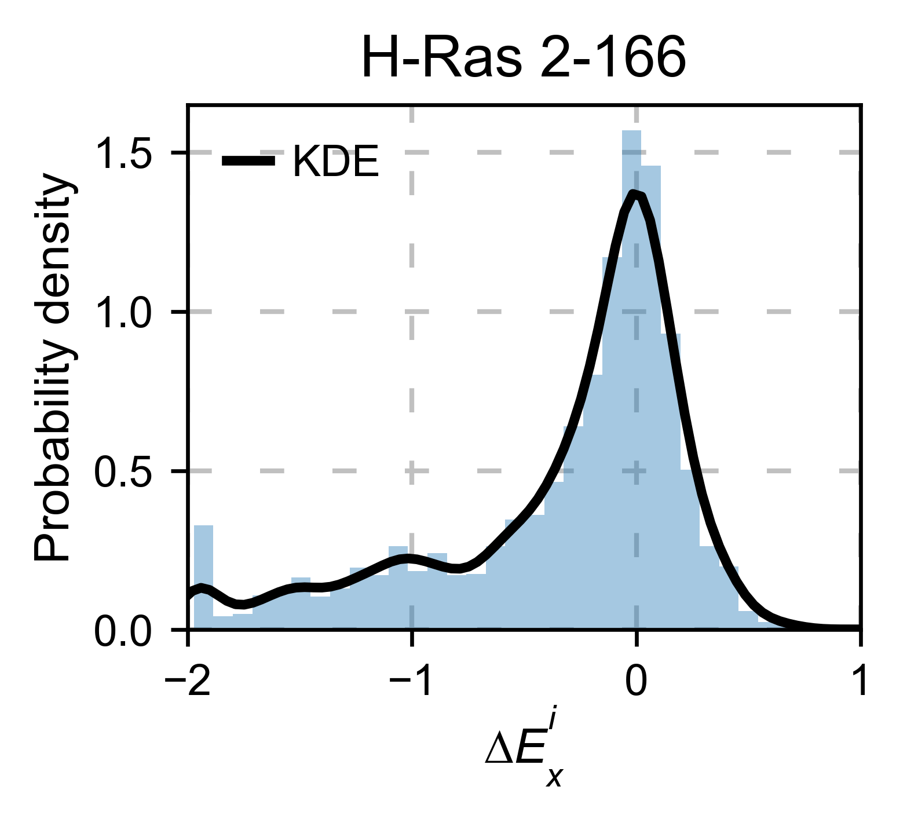

.. image:: images/exported_images/hras_histsnv.png
   :width: 200px

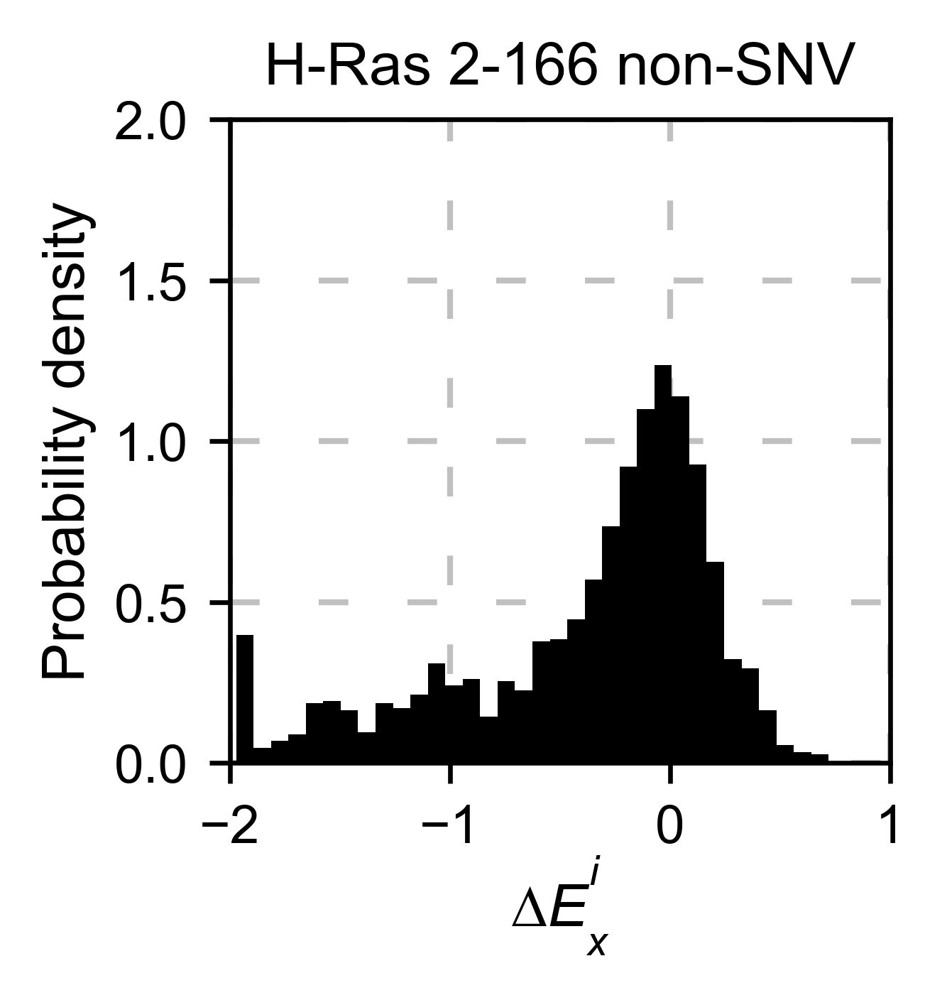

If you have multiple datasets and want to compare them, you can do it
with the method ``object.scatter``. We give the option to do the
comparison at a mutation by mutation level ``mode=pointmutant``, or at a
position level ``mode=mean``.

.. code:: ipython3

    # Plot a scatter plot of each mutation
    hras_rbd.scatter(
        hras_gapgef,
        title='Individual mutations',
        mode='pointmutant',
        xscale=(-2.5, 1.5),
        yscale=(-2.5, 1.5),
        x_label='H-Ras Unregulated',
        y_label='H-Ras Regulated',
    )
    
    # Plot a scatter plot of the mean position
    hras_rbd.scatter(
        hras_gapgef,
        title='Positional average',
        mode='mean',
        xscale=(-2, 1),
        yscale=(-2, 1),
        x_label='H-Ras Unregulated',
        y_label='H-Ras Regulated',
    )

.. image:: images/exported_images/hras_scatter.png
   :width: 200px

.. image:: images/exported_images/hras_scatter_mean.png
   :width: 200px

The method ``object.rank`` sorts each mutation (or position) by its
enrichment score.

.. code:: ipython3

    hras_rbd.rank(mode='pointmutant', outdf=True, title='Rank of mutations')

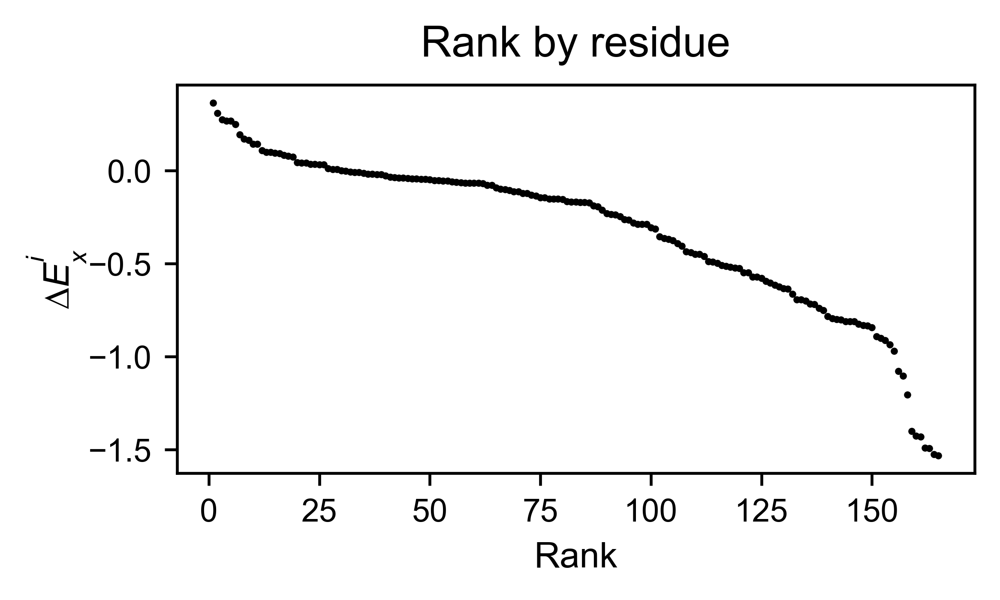
   
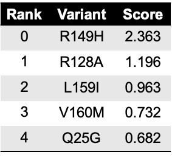

The method ``object.cumulative`` draws a cumulative plot that sums the
mean enrichment score of every position. This plot is useful to
determine if the sensitivity to mutations is constant throughout the
protein or not. In the example, we see that the cumulative function
follows the x=y line, suggestion a homogeneous mutational tolerance.

.. code:: ipython3

    # Cumulative plot
    hras_rbd.cumulative(mode='all', title='Cumulative Score')

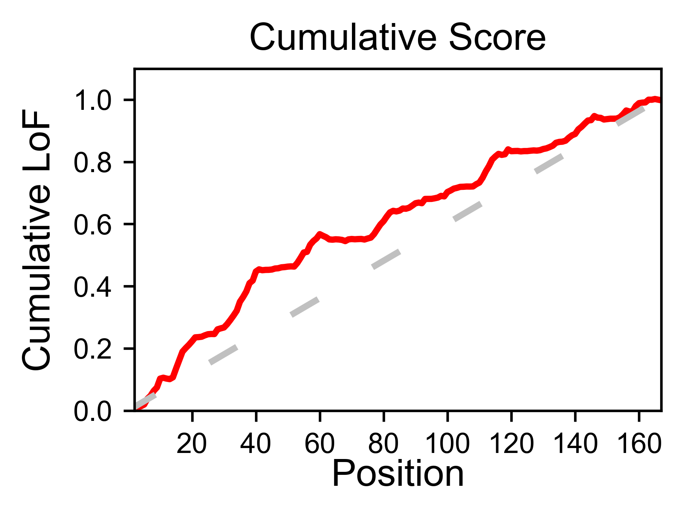

Bar and line charts
-------------------

Classes reviewed in this section:
    - :class:`mutagenesis_visualization.main.bar_graphs.enrichment_bar.EnrichmentBar`
    - :class:`mutagenesis_visualization.main.bar_graphs.differential.Differential`
    - :class:`mutagenesis_visualization.main.bar_graphs.position_bar.PositionBar`
    - :class:`mutagenesis_visualization.main.bar_graphs.secondary.Secondary`

The method ``object.enrichment_bar`` will plot the mean enrichment score
for every position on a bar chart. It will be colored blue for loss of
function and red for gain of function. Additionally, setting the
parameter ``mode`` to an amino acid (using the one letter code) will
plot the enrichment for that particular amino acid along the protein. In
this example, we are showing the mean enrichment scores (top) and an
alanine scan (bottom)

.. code:: ipython3

    # Plot a bar graph with the mean enrichment score
    hras_rbd.enrichment_bar(
        figsize=[6, 2.5],
        mode='mean',
        show_cartoon=True,
        yscale=[-2, 0.5],
        title='',
    )
    
    # Plot a bar graph with the alanine enrichment score
    hras_rbd.enrichment_bar(
        figsize=[6, 2.5],
        mode='A',
        show_cartoon=True,
        yscale=[-2, 0.5],
        title='',
    )

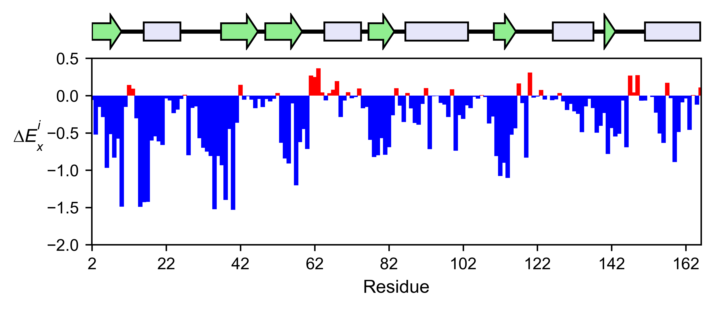
   
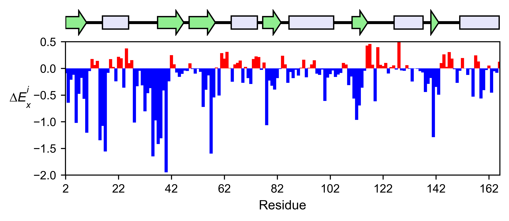

The mean differential effect between the two example datasets is
displayed using the method ``object.differential``. This plot is useful
to compare either orthologs/paralogs or the same protein with different
effectors, and determine which areas of the protein have a different
sensitivity to mutations.

.. code:: ipython3

    # Plot the difference between H-Ras unregulated and H-Ras regulated datasets
    # The subtraction is hras_RBD - hrasGAPGEF
    hras_rbd.differential(
        hras_gapgef,
        figsize=[6, 2.5],
        show_cartoon=True,
        yscale=[-1, 1],
        title='',
    )

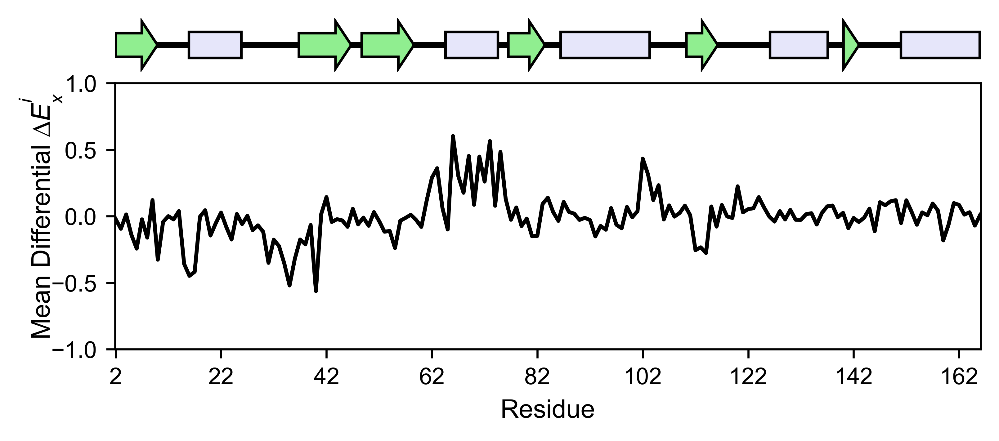

You can check the individual mutational profile of a residue by using
``object.position_bar``.

.. code:: ipython3

    # Create plot for position 117
    hras_rbd.position_bar(
        position=117,
        yscale=(-1.5, 0.8),
        figsize=(3.5, 2),
        title='Position 117',
    )

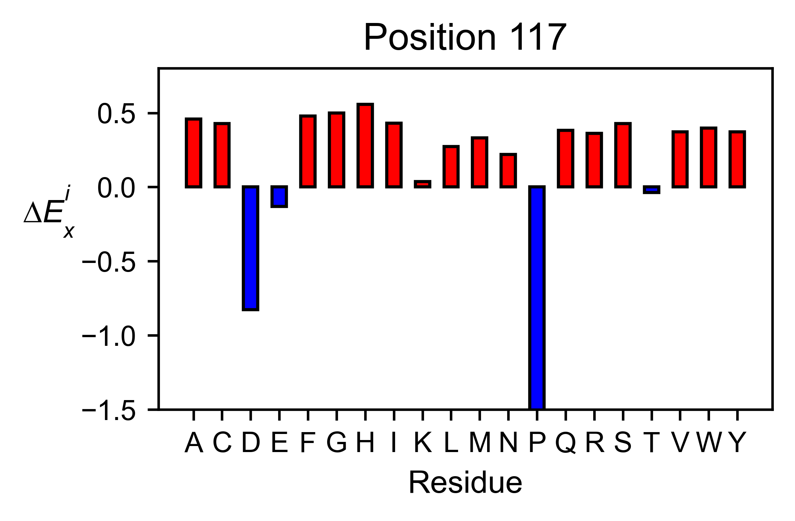

If you added the secondary structure as an attribute of the object, you
can plot the mean enrichment score for each alpha and beta motif in the
protein (``object.secondary_mean``).

.. code:: ipython3

    # Graph bar of the mean of each secondary motif
    hras_rbd.secondary_mean(
        yscale=[-1, 0],
        figsize=[3, 2],
        title='Mean of secondary motifs',
        output_file=None
    )

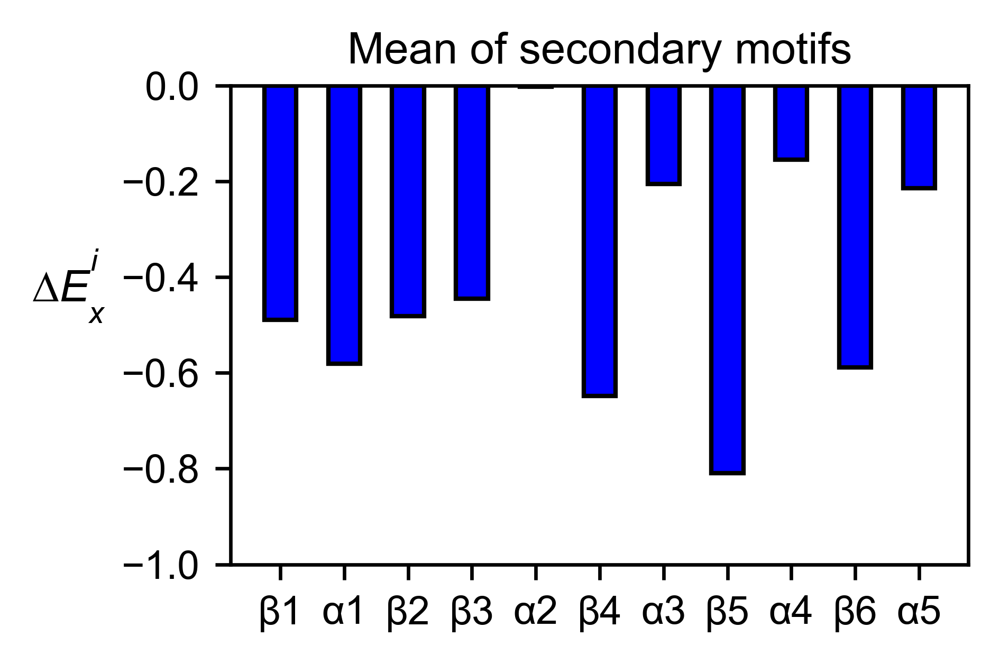

Correlation, PCA and ROC AUC
----------------------------

Classes reviewed in this section:
    - :class:`mutagenesis_visualization.main.pca_analysis.correlation.Correlation`
    - :class:`mutagenesis_visualization.main.pca_analysis.individual_correlation.IndividualCorrelation`
    - :class:`mutagenesis_visualization.main.pca_analysis.pca.PCA`
    - :class:`mutagenesis_visualization.main.other_stats.roc_analysis.ROC`

If you want to know more about PCA and ROC, watch the following StatQuest videos on youtube:
`PCA <https://www.youtube.com/watch?v=FgakZw6K1QQ&ab_channel=StatQuestwithJoshStarmer>`_
`ROC and AUC <https://www.youtube.com/watch?v=4jRBRDbJemM&ab_channel=StatQuestwithJoshStarmer>`_

The correlation of amino acid substitution profiles can be calculated
for each amino acid and graphed using ``object.correlation``. In the
example we observe that polar amino acids have high correlation between
themselves but low correlation with hydrophobic amino acids.

.. code:: ipython3

    # Correlation between amino acids
    hras_rbd.correlation(
        colorbar_scale=[0.5, 1], title='Correlation'
    )

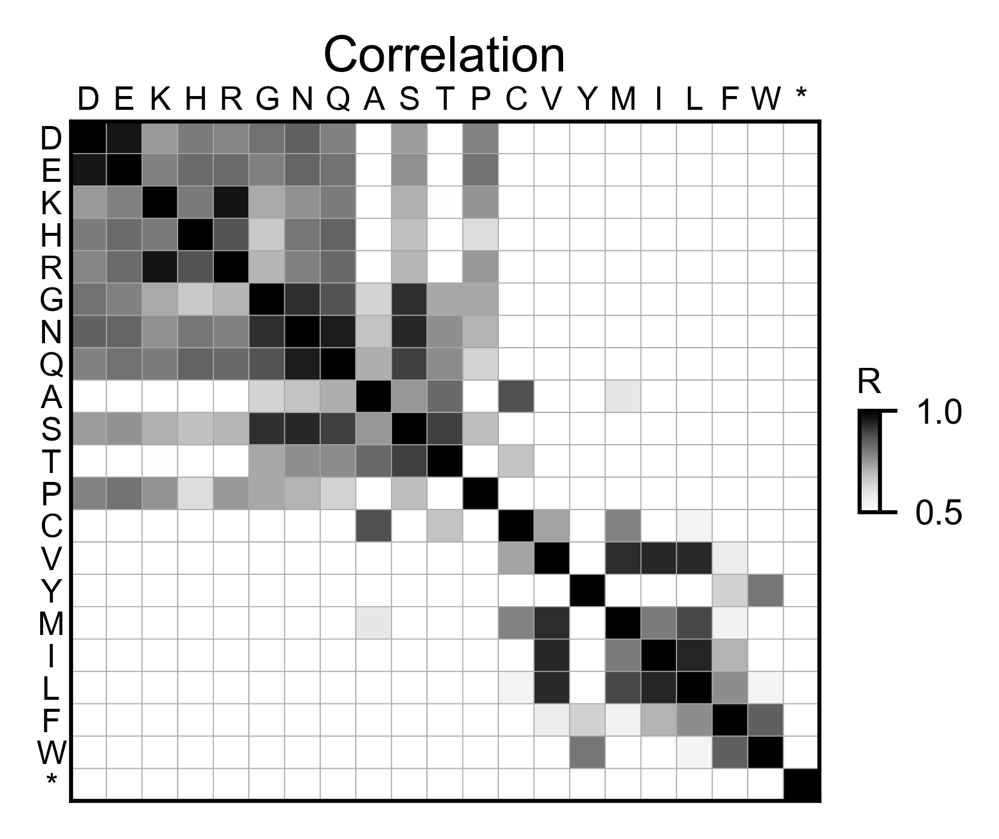

The method ``object.individual_correlation`` will tell you how a single
amino acid substitution profile (row of the heatmap) correlates to the
rest of the dataset.

.. code:: ipython3

    # Explained variability by amino acid
    hras_rbd.individual_correlation(
        yscale=[0, 0.6],
        title='Explained variability by amino acid',
        output_file=None
    )

.. image:: images/exported_images/hras_variability.png
   :width: 300px
   :align: center

The package can perform principal component analysis (PCA) using the
method ``object.pca``. The parameter ``mode`` can be set to
``aminoacid``, in which will cluster amino acids based on their
similarity, ``individual`` in which will do the same for each individual
residue and ``secondary``, in which will cluster for each motif. By
default, the first two dimensions will be plotted (0 and 1 in Python
notation), but that can be changed by ``dimensions`` parameter.

.. code:: ipython3

    # PCA by amino acid substitution
    hras_rbd.pca(
        title='',
        dimensions=[0, 1],
        figsize=(2, 2),
        adjustlabels=True,
        output_file=None
    )
    
    # PCA by secondary structure motif
    hras_rbd.pca(
        title='',
        mode='secondary',
        dimensions=[0, 1],
        figsize=(2, 2),
        adjustlabels=True,
        output_file=None
    )
    
    # PCA by each individual residue. Don't set adjustlabels = True unless really big figsize
    hras_rbd.pca(
        title='',
        mode='individual',
        dimensions=[0, 1],
        figsize=(5, 5),
        adjustlabels=False,
        output_file=None
    )

.. image:: images/exported_images/hras_pcaaminoacid.png
   :width: 200px

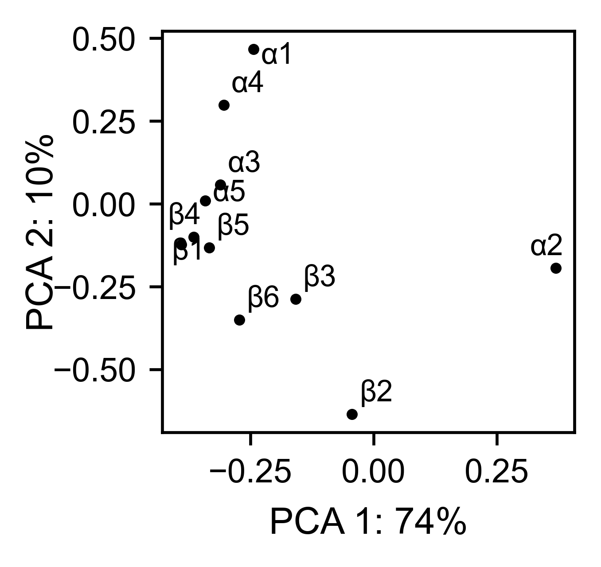

.. image:: images/exported_images/hras_pcaindividual.png
   :width: 250px

Another type of plot that can be done is a receiver operating
characteristic (ROC) curve for classification. You will use the method
``object.roc`` and as an input you will pass a dataframe that contains
the label for each variant.

.. code:: ipython3

    #  Fake data
    df_freq: DataFrame = DataFrame()
    df_freq['Variant'] = hras_rbd.dataframes.df_notstopcodons[-1]['Variant']
    df_freq['Class'] = np.random.randint(2, size=len(df_freq))
    
    # Plot ROC curve
    hras_rbd.roc(
        df_freq[['Variant', 'Class']],
        title='ROC example',
    )

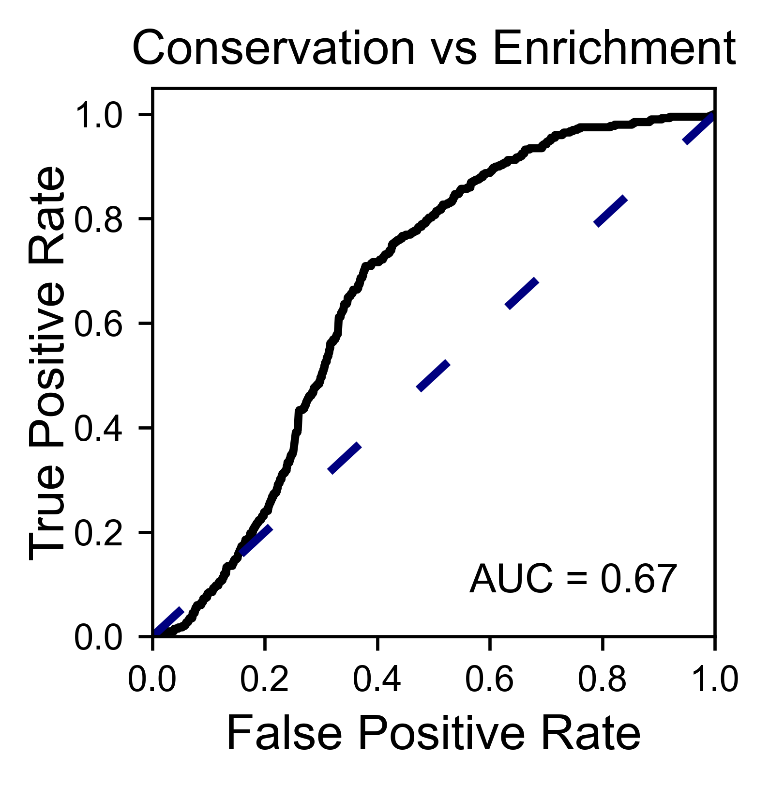

Pymol
-----

Class reviewed in this section:
    - :class:`mutagenesis_visualization.main.pymol.pymol.Pymol`

The data can be visualized on a Pymol object using ``object.pymol``. It
is important that not only Pymol is installed, but also on the same path
as Python. You may have to manually install the ipymol API. See the
Getting Started chapter for more information.

The parameter ``pdb`` will fetch the pdb that you want to use. Note that
the protein chain needs to be specified (see example). Red for gain of
function and blue for loss of function. ``mode`` lets you specifiy
whether to plot the mean or an individual amino acid profile (left -
Leucine, right - Aspartate).

.. code:: ipython3

    # Start pymol and color residues. Cut offs are set with gof and lof parameters.
    hras_rbd.pymol(pdb='5p21_A', mode='mean', gof=0.2, lof=-0.5)
    
    # Now check the mutational profile of Leucine (left image)
    hras_rbd.pymol(pdb='5p21_A', mode='L', gof=0.2, lof=-0.5)
    
    # Now check the mutational profile of Aspartate (right image)
    hras_rbd.pymol(pdb='5p21_A', mode='D', gof=0.2, lof=-0.5)

.. image:: images/exported_images/hras_pymol_combLD.png
   :align: center

Art
---

The heatmap method can be used to generate artistic plots such as the
one in the documentation overview. In here we show how that is done. On
an Excel we have defined the color for each square in the heatmap (also
available with the package, see ``logo.xlsx``). The first step is to
import the excel file, and then we perform the same steps as in a normal
dataset.

.. code:: ipython3

    %matplotlib inline
    
    from mutagenesis_visualization.main.classes.screen import Screen
    from mutagenesis_visualization.main.utils.data_paths import PATH_LOGO
    # Read excel file
    usecols = 'A:BL'
    #df_logo = pd.read_excel(path, 'logo', usecols=usecols, nrows=21)
    #df_faded = pd.read_excel(path, 'logo_faded', usecols=usecols, nrows=21)
    df_logo = pd.read_excel(PATH_LOGO, 'logo_2', usecols=usecols, nrows=21)
    df_faded = pd.read_excel(PATH_LOGO, 'logo_faded_2', usecols=usecols, nrows=21)
    
    # Combine two dataframes
    df_mixed = df_logo * 1.2 - df_faded
    
    # Aminoacids
    aminoacids = list('ACDEFGHIKLMNPQRSTVWY*')
    
    # Define protein sequence
    sequence_logo = "FUNNY THAT YOU ARE READING THIS SEQUENCE. NO SECRET CODE FOR NOW"
    
    # Define secondary structure
    secondary = [['L0'] * 5, ['β1'] * (9 - 1), ['L1'] * (15 - 9),
                 ['α1'] * (25 - 20), ['L2'] * (32 - 25), ['β2'] * (42 - 32),
                 ['L3'] * (50 - 42), ['α2'] * (58 - 50), ['L4'] * (70 - 58)]
    
    # Create object
    logo_obj = Screen(
        df_mixed, sequence_logo, aminoacids = aminoacids, start_position=1, fillna=0, secondary=secondary
    )
    
    # Create hetmap
    logo_obj.heatmap(
        show_cartoon=True,
        title='',
        neworder_aminoacids='ACDEFGHIKLMNPQRSTVWY*',
    )

.. image:: images/exported_images/heatmap_intro.png
   :width: 350px
   :align: center

Reference
---------

.. [#Pradeep2017] Bandaru, P., Shah, N. H., Bhattacharyya, M., Barton, J. P., Kondo, Y., Cofsky, J. C., … Kuriyan, J. (2017). Deconstruction of the Ras switching cycle through saturation mutagenesis. ELife, 6. `DOI: 10.7554/eLife.27810  <https://elifesciences.org/articles/27810>`_
