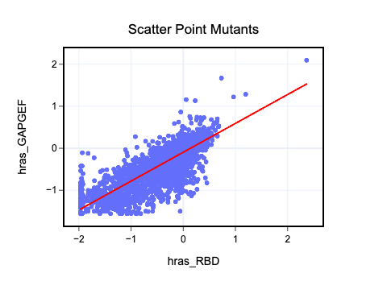
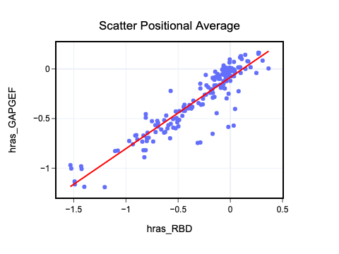

Visualizing with plotly
=======================

In this section we will use Plotly to make interactive plots. Please let
us know if you have suggestions for new figures that could be made with
Plotly.

.. code:: ipython3

    import numpy as np
    import pandas as pd
    
    try:
        import mutagenesis_visualization as mut
    except ModuleNotFoundError: # This step is only for when I run the notebooks locally
        import sys
        sys.path.append('../../')
        import mutagenesis_visualization as mut

Load sample datasets.

.. code:: ipython3

    data_dict = mut.demo_datasets()  # load example datasets
    hras_enrichment_GAPGEF = data_dict['array_hras_GAPGEF']
    hras_enrichment_RBD = data_dict['array_hras_RBD']

Create objects.

.. code:: ipython3

    # Load enrichment scores. This is how you would load them from a local file.
    hras_enrichment_GAPGEF = np.genfromtxt(
        '../data/HRas166_GAPGEF.csv', delimiter=','
    )
    
    hras_enrichment_RBD = np.genfromtxt('../data/HRas166_RBD.csv', delimiter=',')
    
    # Define protein sequence
    hras_sequence = 'MTEYKLVVVGAGGVGKSALTIQLIQNHFVDEYDPTIEDSYRKQVVIDGETCLLDILDTAGQEEY'\
                    + 'SAMRDQYMRTGEGFLCVFAINNTKSFEDIHQYREQIKRVKDSDDVPMVLVGNKCDLAARTVES'\
                    + 'RQAQDLARSYGIPYIETSAKTRQGVEDAFYTLVREIRQHKLRKLNPPDESGPG'
    
    # Order of amino acid substitutions in the hras_enrichment dataset
    aminoacids = list('ACDEFGHIKLMNPQRSTVWY*')
    
    # First residue of the hras_enrichment dataset. Because 1-Met was not mutated, the dataset starts at residue 2
    start_position = 2
    
    # Define secondary structure
    secondary = [['L0'], ['β1'] * (9 - 1), ['L1'] * (15 - 9), ['α1'] * (25 - 15),
                 ['L2'] * (36 - 25), ['β2'] * (46 - 36), ['L3'] * (48 - 46),
                 ['β3'] * (58 - 48), ['L4'] * (64 - 58), ['α2'] * (74 - 64),
                 ['L5'] * (76 - 74), ['β4'] * (83 - 76), ['L6'] * (86 - 83),
                 ['α3'] * (103 - 86), ['L7'] * (110 - 103), ['β5'] * (116 - 110),
                 ['L8'] * (126 - 116), ['α4'] * (137 - 126), ['L9'] * (140 - 137),
                 ['β6'] * (143 - 140), ['L10'] * (151 - 143), ['α5'] * (172 - 151),
                 ['L11'] * (190 - 172)]
    
    # Substitute Nan values with 0
    fillna = 0
    
    # Create objects
    hras_GAPGEF = mut.Screen(
        hras_enrichment_GAPGEF, hras_sequence, aminoacids, start_position, fillna,
        secondary
    )
    hras_RBD = mut.Screen(
        hras_enrichment_RBD, hras_sequence, aminoacids, start_position, fillna,
        secondary
    )

Rank
----

Create an interactive rank figure that displays each mutant.

.. code:: ipython3

    hras_RBD.rank_plotly(title='Rank of pointmutants')

.. image:: images/plotly_images/hras_rankpointmutants.png
   :width: 300px
   :align: center

Now display the rank of the positional mean.

.. code:: ipython3

    hras_RBD.rank_plotly(mode='mean', title='Rank of positions')

.. image:: images/plotly_images/hras_rankposition.png
   :width: 300px
   :align: center

Scatter
-------

If you have two datasets, you can create a scatter plot. The advantage
of using plotly over matplotlib is that you can visually check each data
point by putting the mouse pointer on top.

.. code:: ipython3

    hras_RBD.scatter_plotly(hras_GAPGEF, show_results=False, title='Scatter Point Mutants',
                           x_label = 'hras_RBD', y_label = 'hras_GAPGEF')

Now we just look at the positional average.

.. code:: ipython3

    hras_RBD.scatter_plotly(hras_GAPGEF, mode='mean', title='Scatter Positional Average',
                           x_label = 'hras_RBD', y_label = 'hras_GAPGEF')

