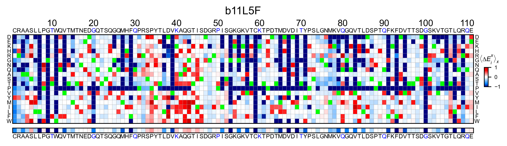
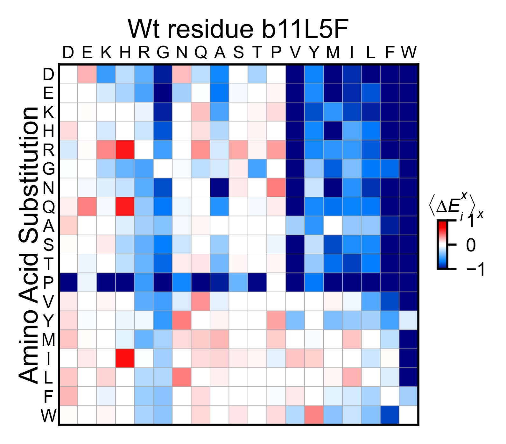
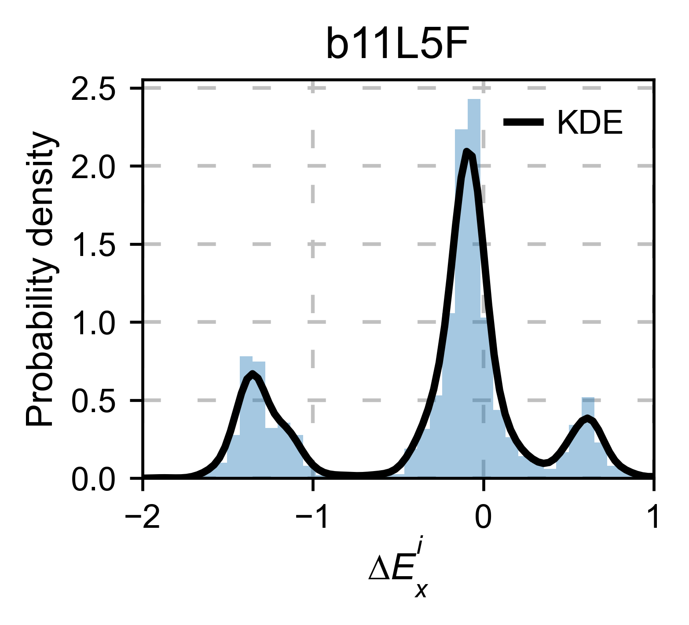
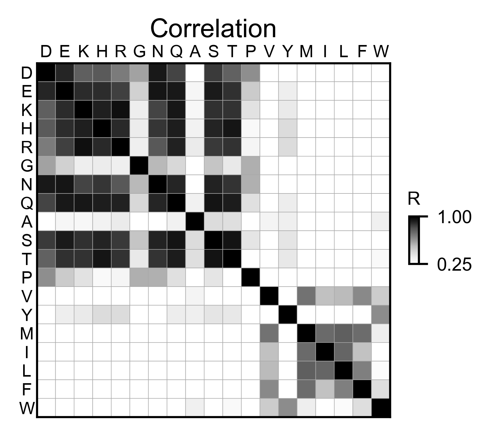
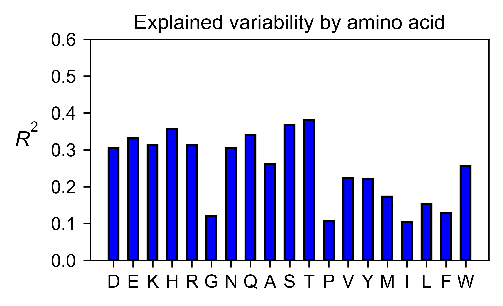

Other datasets
==============

Up to this moment, we have only shown how the package performs with our
own dataset. The moment of truth is when we test our software with other
people’s datasets. In this section we have compiled saturation
mutagenesis datasets found in the literature and we reproduce the
analysis. Not only does the package works with other datasets, but also
it allows to customize a wide range of parameters such as color maps,
scales, etc. Furthermore, on top of testing the resilience of
``mutagenesis_visualization``, we are providing extra examples on how to
use this API.

.. code:: python

    %matplotlib inline
    from typing import Dict, Union, List
    from pandas.core.frame import DataFrame
    import numpy as np
    import pandas as pd
    import matplotlib as plt
    import copy
    
    from mutagenesis_visualization.main.classes.screen import Screen
    from mutagenesis_visualization.main.demo.demo_data import load_demo_datasets
    from mutagenesis_visualization.main.utils.data_paths import PDB_1ERM, PDB_1A5R, PDB_1ND4
    
    DEMO_DATASETS: Dict[str, Union[np.array, DataFrame]] = load_demo_datasets()

Load objects
------------

For simplicity, we also have added the option of loading those datasets
into objects automatically. The command to do that would be
``DEMO_OBJECTS.name_object()``. There are 10 objects to load (hras_rbd,
hras_gapgef, bla_obj, sumo_obj, mapk1_obj, ube2i_obj, tat_obj, rev_obj,
asynuclein_obj, aph_obj, b11l5f_obj).

Beta Lactamase
--------------

Create object
~~~~~~~~~~~~~

.. code:: python

    #https://www.uniprot.org/uniprot/P62593#sequences
    
    # Order of amino acid substitutions in the hras_enrichment dataset
    aminoacids: List[str] = list(DEMO_DATASETS['df_bla'].index)
    neworder_aminoacids: List[str]  = list('DEKHRGNQASTPCVYMILFW')
    
    # First residue of the hras_enrichment dataset. Because 1-Met was not mutated, the dataset starts at residue 2
    start_position = DEMO_DATASETS['df_bla'].columns[0]
    
    # Define sequence. If you dont know the start of the sequence, just add X's
    sequence_bla_x = 'MSIQHFRVALIPFFAAFCLPVFAHPETLVKVKDAEDQLGARVGYIELDLNSGKILESFRP' + 'EERFPMMSTFKVLLCGAVLSRVDAGQEQLGRRIHYSQNDLVEYSPVTEKHLTDGMTVREL' + 'CSAAITMSDNTAANLLLTTIGGPKELTAFLHNMGDHVTRLDRWEPELNEAIPNDERDTTM' + 'PAAMATTLRKLLTGELLTLASRQQLIDWMEADKVAGPLLRSALPAGWFIADKSGAGERGS' + 'RGIIAALGPDGKPSRIVVIYTTGSQATMDERNRQIAEIGASLIKHW'
    
    # Define secondary structure
    secondary_bla = [['L0'] * 23, ['α1'] * (38 - 23), ['L1'] * 2, ['β1'] * (48 - 40),
                        ['L2'] * 5, ['β2'] * (57 - 53), ['L3'] * (68 - 57), ['α2'] * (84 - 68),
                        ['L4'] * (95 - 84), ['α3'] * (100 - 95), ['L5'] * (103 - 100),
                        ['α4'] * (110 - 103), ['L6'] * (116 - 110), ['α5'] * (140 - 116),
                        ['L7'] * (1), ['α6'] * (153 - 141), ['L8'] * (164 - 153),
                        ['α7'] * (169 - 164), ['L9'] * (179 - 169), ['α8'] * (194 - 179), ['L10'] *
                        3, ['α9'] * (210 - 197), ['L11'] * (227 - 210), ['β3'] * (235 - 227),
                        ['L12'] * (240 - 235), ['β4'] * (249 - 240), ['L13'] * (254 - 249),
                        ['β5'] * (262 - 254), ['L14'] * (266 - 262), ['α10'] * (286 - 266)]
    
    bla_obj: Screen = Screen(
        DEMO_DATASETS['df_bla'], sequence_bla_x, aminoacids, start_position, 0, secondary_bla
    )

2D Plots
~~~~~~~~

.. code:: python

    # Create full heatmap
    bla_obj.heatmap(
        colorbar_scale=(-3, 3),
        neworder_aminoacids=neworder_aminoacids,
        title='Beta Lactamase',
        show_cartoon=True,
    )
    
    # Miniheatmap
    bla_obj.miniheatmap(
        title='Wt residue Beta Lactamase',
        neworder_aminoacids=neworder_aminoacids,
    )
    
    # Positional mean
    bla_obj.enrichment_bar(
        figsize=[10, 2.5],
        mode='mean',
        show_cartoon=True,
        yscale=[-3, 0.25],
        title='',
    )
    
    # Kernel
    bla_obj.kernel(
        histogram=True, title='Beta Lactamase', xscale=[-4, 1]
    )
    
    # Graph bar of the mean of each secondary motif
    bla_obj.secondary_mean(
        yscale=[-1.5, 0],
        figsize=[5, 2],
        title='Mean of secondary motifs',
    )
    
    # Correlation between amino acids
    bla_obj.correlation(
        colorbar_scale=[0.5, 1],
        title='Correlation',
        neworder_aminoacids=neworder_aminoacids,
    )
    
    # Explained variability by amino acid
    bla_obj.individual_correlation(
        yscale=[0, 0.6],
        title='Explained variability by amino acid',
    )
    
    # PCA by amino acid substitution
    bla_obj.pca(
        title='',
        dimensions=[0, 1],
        figsize=(2, 2),
        adjustlabels=True,
    )
    
    # PCA by secondary structure motif
    bla_obj.pca(
        title='',
        mode='secondary',
        dimensions=[0, 1],
        figsize=(2, 2),
        adjustlabels=True,
    )

.. image:: images/other_examples/bla_fullheatmap.png

.. image:: images/other_examples/bla_miniheatmap.png
   :width: 200px
   :align: center
   
.. image:: images/other_examples/bla_bar_mean.png
   :align: center
   
.. image:: images/other_examples/bla_kde.png
   :width: 240px
   :align: center

.. image:: images/other_examples/bla_secondary.png
   :width: 300px
   :align: center
   
.. image:: images/other_examples/bla_correlation.png
   :width: 250px
   :align: center
   
.. image:: images/other_examples/bla_variability.png
   :width: 300px
   :align: center
   
.. image:: images/other_examples/bla_pcaaminoacid.png
   :width: 200px

.. image:: images/other_examples/bla_pcasecondary.png
   :width: 200px

3D Plots
~~~~~~~~

.. code:: python

    # Plot 3-D plot
    bla_obj.plotly_scatter_3d(
        mode='mean',
        pdb_path=PDB_1ERM,
        position_correction=2,
        title='Scatter 3D',
        squared=False,
        x_label='x',
        y_label='y',
        z_label='z',
    )
    
    # Plot 3-D of distance to center of protein, SASA and B-factor
    bla_obj.plotly_scatter_3d_pdbprop(
        plot=['Distance', 'SASA', 'log B-factor'],
        position_correction=2,
        pdb_path=PDB_1ERM,
        title='Scatter 3D - PDB properties',
    )

.. raw:: html
    :file: html/bla_3dscatter.html
    
.. raw:: html
    :file: html/bla_3d_pdbprop.html

.. code:: python

    # Start pymol and color residues. Cut offs are set with gof and lof parameters.
    bla_obj.pymol(
        pdb=PDB_1ERM, mode='mean', gof=0.2, lof=-1, position_correction=2
    )

.. image:: images/other_examples/bla_pymol.png
   :align: center

Sumo1
-----

Create object
~~~~~~~~~~~~~

.. code:: python

    #https://doi.org/10.15252/msb.20177908
    
    # Order of amino acid substitutions in the hras_enrichment dataset
    aminoacids = list(DEMO_DATASETS['df_sumo1'].index)
    
    # First residue of the hras_enrichment dataset. Because 1-Met was not mutated, the dataset starts at residue 2
    start_position = DEMO_DATASETS['df_sumo1'].columns[0]
    
    # Full sequence
    sequence_sumo1 = 'MSDQEAKPSTEDLGDKKEGEYIKLKVIGQDSSEIHFKVKMTTHLKKLKESYCQRQGVPMN' + 'SLRFLFEGQRIADNHTPKELGMEEEDVIEVYQEQTGGHSTV'
    
    # Define secondary structure
    secondary_sumo1 = [['L0'] * (20), ['β1'] * (28 - 20), ['L1'] * 3, ['β2'] * (39 - 31),
                        ['L2'] * 4, ['α1'] * (55 - 43),
                        ['L3'] * (6), ['β3'] * (65 - 61), ['L4'] * (75 - 65), ['α2'] * (80 - 75),
                        ['L5'] * (85 - 80), ['β4'] * (92 - 85), ['L6'] * (101 - 92)]
    
    sumo_obj: Screen = Screen(
        DEMO_DATASETS['df_sumo1'], sequence_sumo1, aminoacids, start_position, 1,
        secondary_sumo1
    )

2D Plots
~~~~~~~~

.. code:: python

    # You can use your own colormap or import it from matplotlib
    colormap = copy.copy((plt.cm.get_cmap('Blues_r')))
    
    # Create full heatmap
    sumo_obj.heatmap(
        colorbar_scale=(-0.5, 1),
        neworder_aminoacids=neworder_aminoacids,
        title='Sumo1',
        colormap=colormap,
        show_cartoon=True,
    )
    
    # Miniheatmap
    sumo_obj.miniheatmap(
        colorbar_scale=(0, 1),
        title='Wt residue Sumo1',
        neworder_aminoacids=neworder_aminoacids,
        colormap=colormap,
    )
    
    # Positional mean
    sumo_obj.enrichment_bar(
        figsize=[6, 2.5],
        mode='mean',
        show_cartoon=True,
        yscale=[0, 1],
        title='',
    )
    
    # Kernel
    sumo_obj.kernel(histogram=True, title='Sumo1', xscale=[-1, 2], output_file=None)
    
    # Graph bar of the mean of each secondary motif
    sumo_obj.secondary_mean(
        yscale=[0, 1],
        figsize=[2, 2],
        title='Mean of secondary motifs',
    )
    
    # Correlation between amino acids
    sumo_obj.correlation(
        colorbar_scale=[0.25, 0.75],
        title='Correlation',
        neworder_aminoacids=neworder_aminoacids,
    )
    
    # Explained variability by amino acid
    sumo_obj.individual_correlation(
        yscale=[0, 0.6],
        title='Explained variability by amino acid',
    )
    
    # PCA by amino acid substitution
    sumo_obj.pca(
        title='',
        dimensions=[0, 1],
        figsize=(2, 2),
        adjustlabels=True,
    )
    
    # PCA by secondary structure motif
    sumo_obj.pca(
        title='',
        mode='secondary',
        dimensions=[0, 1],
        figsize=(2, 2),
        adjustlabels=True,
    )

.. image:: images/other_examples/sumo_fullheatmap.png

.. image:: images/other_examples/sumo_miniheatmap.png
   :width: 200px
   :align: center
   
.. image:: images/other_examples/sumo_bar_mean.png
   :width: 400px
   :align: center
   
.. image:: images/other_examples/sumo_kde.png
   :width: 240px
   :align: center

.. image:: images/other_examples/sumo_secondary.png
   :width: 300px
   :align: center
   
.. image:: images/other_examples/sumo_correlation.png
   :width: 250px
   :align: center
   
.. image:: images/other_examples/sumo_variability.png
   :width: 300px
   :align: center
   
.. image:: images/other_examples/sumo_pcaaminoacid.png
   :width: 200px

.. image:: images/other_examples/sumo_pcasecondary.png
   :width: 200px

.. code:: python

    # Open pymol and color the sumo structure
    sumo_obj.pymol(pdb=PDB_1A5R, mode='mean', gof=1, lof=0.5)

.. image:: images/other_examples/sumo_pymol.png
   :align: center

MAPK1
-----

Create object
~~~~~~~~~~~~~

.. code:: python

    # Order of amino acid substitutions in the hras_enrichment dataset
    aminoacids = list(DEMO_DATASETS['df_mapk1'].index)
    
    # First residue of the hras_enrichment dataset. Because 1-Met was not mutated, the dataset starts at residue 2
    start_position = DEMO_DATASETS['df_mapk1'].columns[0]
    
    # Full sequence
    sequence_mapk1_x = 'MAAAAAAGAGPEMVRGQVFDVGPRYTNLSYIGEGAYGMVCSAYDNVNKVRVAIK' + 'KISPFEHQTYCQRTLREIKILLRFRHENIIGINDIIRAPTIEQMKDVYIVQDLMETDLYKLLKTQ' + 'HLSNDHICYFLYQILRGLKYIHSANVLHRDLKPSNLLLNTTCDLKICDFGLARVADPDHDHTGFL' + 'TEYVATRWYRAPEIMLNSKGYTKSIDIWSVGCILAEMLSNRPIFPGKHYLDQLNHILGILGSPSQ' + 'EDLNCIINLKARNYLLSLPHKNKVPWNRLFPNADSKALDLLDKMLTFNPHKRIEVEQALAHPYLE' + 'QYYDPSDEPIAEAPFKFDMELDDLPKEKLKELIFEETARFQPGYRS'
    
    # Create objects
    mapk1_obj: Screen = Screen(DEMO_DATASETS['df_mapk1'], sequence_mapk1_x, aminoacids, start_position, 0)

2D Plots
~~~~~~~~

.. code:: python

    # Create full heatmap
    mapk1_obj.heatmap(
        colorbar_scale=(-2, 2),
        neworder_aminoacids=neworder_aminoacids,
        title='MAPK1',
        show_cartoon=False,
    )
    
    # Miniheatmap
    mapk1_obj.miniheatmap(
        title='Wt residue MAPK1',
        neworder_aminoacids=neworder_aminoacids,
    )
    
    # Positional mean
    mapk1_obj.enrichment_bar(
        figsize=[10, 2.5],
        mode='mean',
        show_cartoon=False,
        yscale=[-1, 1],
        title='',
    )
    
    # Kernel
    mapk1_obj.kernel(
        histogram=True, title='MAPK1', xscale=[-2, 2], output_file=None
    )
    
    # Correlation between amino acids
    mapk1_obj.correlation(
        colorbar_scale=[0.25, 0.75],
        title='Correlation',
        neworder_aminoacids=neworder_aminoacids,
    )
    
    # Explained variability by amino acid
    mapk1_obj.individual_correlation(
        yscale=[0, 0.6],
        title='Explained variability by amino acid',
    )
    
    # PCA by amino acid substitution
    mapk1_obj.pca(
        title='',
        dimensions=[0, 1],
        figsize=(2, 2),
        adjustlabels=True,
    )

.. image:: images/other_examples/mapk1_fullheatmap.png

.. image:: images/other_examples/mapk1_miniheatmap.png
   :width: 200px
   :align: center
   
.. image:: images/other_examples/mapk1_bar_mean.png
   :width: 400px
   :align: center
   
.. image:: images/other_examples/mapk1_kde.png
   :width: 240px
   :align: center
   
.. image:: images/other_examples/mapk1_correlation.png
   :width: 250px
   :align: center
   
.. image:: images/other_examples/mapk1_variability.png
   :width: 300px
   :align: center
   
.. image:: images/other_examples/mapk1_pcaaminoacid.png
   :width: 200px
   :align: center

UBE2I
-----

Create object
~~~~~~~~~~~~~

.. code:: python

    # Order of amino acid substitutions in the hras_enrichment dataset
    aminoacids = list(DEMO_DATASETS['df_ube2i'].index)
    
    # First residue of the hras_enrichment dataset. Because 1-Met was not mutated, the dataset starts at residue 2
    start_position = DEMO_DATASETS['df_ube2i'].columns[0]
    
    # Full sequence
    sequence_ube2i_x = 'MSGIALSRLAQERKAWRKDHPFGFVAVPTKNPDGTMNLMNWECAIPGKKGTP' + 'WEGGLFKLRMLFKDDYPSSPPKCKFEPPLFHPNVYPSGTVCLSILEEDKDWRPAITIKQ' + 'ILLGIQELLNEPNIQDPAQAEAYTIYCQNRVEYEKRVRAQAKKFAPS'
    
    # Define secondary structure
    secondary_ube2i = [['α1'] * (20 - 1), ['L1'] * (24 - 20), ['β1'] * (30 - 24), ['L2'] * 5,
                        ['β2'] * (46 - 35), ['L3'] * (56 - 46), ['β3'] * (63 - 56),
                        ['L4'] * (73 - 63), ['β4'] * (77 - 73), ['L5'] * (93 - 77),
                        ['α2'] * (98 - 93), ['L6'] * (107 - 98), ['α3'] * (122 - 107),
                        ['L7'] * (129 - 122), ['α4'] * (155 - 129), ['L8'] * (160 - 155)]
    
    # Create objects
    ube2i_obj: Screen = Screen(
        DEMO_DATASETS['df_ube2i'], sequence_ube2i_x, aminoacids, start_position, 1,
        secondary_ube2i
            )

2D Plots
~~~~~~~~

.. code:: python

    colormap = copy.copy((plt.cm.get_cmap('Blues_r')))
    
    # Create full heatmap
    ube2i_obj.heatmap(
        colorbar_scale=(0, 1),
        neworder_aminoacids=neworder_aminoacids,
        title='Ube2i',
        colormap=colormap,
        show_cartoon=True,
    )
    
    # Miniheatmap
    ube2i_obj.miniheatmap(
        colorbar_scale=(0, 1),
        title='Wt residue Ube2i',
        neworder_aminoacids=neworder_aminoacids,
        colormap=colormap,
    )
    
    # Positional mean
    ube2i_obj.enrichment_bar(
        figsize=[10, 2.5],
        mode='mean',
        show_cartoon=True,
        yscale=[0, 2],
        title='',
    )
    
    # Kernel
    ube2i_obj.kernel(
        histogram=True, title='Ube2i', xscale=[-1, 2], output_file=None
    )
    
    # Graph bar of the mean of each secondary motif
    ube2i_obj.secondary_mean(
        yscale=[0, 2],
        figsize=[3, 2],
        title='Mean of secondary motifs',
    )
    
    # Correlation between amino acids
    ube2i_obj.correlation(
        colorbar_scale=[0.25, 0.75],
        title='Correlation',
        neworder_aminoacids=neworder_aminoacids,
    )
    
    # Explained variability by amino acid
    ube2i_obj.individual_correlation(
        yscale=[0, 0.6],
        title='Explained variability by amino acid',
    )
    
    # PCA by amino acid substitution
    ube2i_obj.pca(
        title='',
        dimensions=[0, 1],
        figsize=(2, 2),
        adjustlabels=True,
    )
    
    # PCA by secondary structure motif
    ube2i_obj.pca(
        title='',
        mode='secondary',
        dimensions=[0, 1],
        figsize=(2, 2),
        adjustlabels=True,
    )

.. image:: images/other_examples/ube2i_fullheatmap.png

.. image:: images/other_examples/ube2i_miniheatmap.png
   :width: 200px
   :align: center
   
.. image:: images/other_examples/ube2i_bar_mean.png
   :width: 400px
   :align: center
   
.. image:: images/other_examples/ube2i_kde.png
   :width: 240px
   :align: center

.. image:: images/other_examples/ube2i_secondary.png
   :width: 300px
   :align: center
   
.. image:: images/other_examples/ube2i_correlation.png
   :width: 250px
   :align: center
   
.. image:: images/other_examples/ube2i_variability.png
   :width: 300px
   :align: center
   
.. image:: images/other_examples/ube2i_pcaaminoacid.png
   :width: 200px

.. image:: images/other_examples/ube2i_pcasecondary.png
   :width: 200px

TAT
---

Create object
~~~~~~~~~~~~~

.. code:: python

    #https://doi.org/10.1016/j.cell.2016.11.031
    
    # Order of amino acid substitutions in the hras_enrichment dataset
    aminoacids = list(DEMO_DATASETS['df_tat'].index)
    
    # First residue of the hras_enrichment dataset. Because 1-Met was not mutated, the dataset starts at residue 2
    start_position = DEMO_DATASETS['df_tat'].columns[0]
    
    # Full sequence
    sequence_tat = 'MEPVDPRLEPWKHPGSQPKTACTNCYCKKCCFHCQVCFITKALGISYGRKKRRQRRRAHQ' + 'NSQTHQASLSKQPTSQPRGDPTGPKE'
    
    # Define secondary structure
    secondary_tat = [['L1'] * (8), ['α1'] * (13 - 8), ['L2'] * (28 - 14), ['α2'] * (41 - 28),
                        ['L3'] * (90 - 41)]
    
    tat_obj: Screen = Screen(
        DEMO_DATASETS['df_tat'], sequence_tat, aminoacids, start_position, 0, secondary_tat
    )

2D Plots
~~~~~~~~

.. code:: python

    # Create full heatmap
    tat_obj.heatmap(
        colorbar_scale=(-0.75, 0.75),
        neworder_aminoacids=neworder_aminoacids,
        title='TAT',
        show_cartoon=True,
    
    )
    
    # Miniheatmap
    tat_obj.miniheatmap(
        title='Wt residue TAT',
        colorbar_scale=(-0.75, 0.75),
        neworder_aminoacids=neworder_aminoacids,
    
    )
    
    # Positional mean
    tat_obj.enrichment_bar(
        figsize=[6, 2.5],
        mode='mean',
        show_cartoon=True,
        yscale=[-0.5, 0.25],
        title='',
    
    )
    
    # Kernel
    tat_obj.kernel(histogram=True, title='TAT', xscale=[-1, 1], output_file=None)
    
    # Correlation between amino acids
    tat_obj.correlation(
        colorbar_scale=[0.25, 1],
        title='Correlation',
        neworder_aminoacids=neworder_aminoacids,
    
    )
    
    # Explained variability by amino acid
    tat_obj.individual_correlation(
        yscale=[0, 0.6],
        title='Explained variability by amino acid',
    
    )
    
    # PCA by amino acid substitution
    tat_obj.pca(
        title='',
        dimensions=[0, 1],
        figsize=(2, 2),
        adjustlabels=True,
    
    )

.. image:: images/other_examples/tat_fullheatmap.png

.. image:: images/other_examples/tat_miniheatmap.png
   :width: 200px
   :align: center
   
.. image:: images/other_examples/tat_bar_mean.png
   :width: 400px
   :align: center
   
.. image:: images/other_examples/tat_kde.png
   :width: 240px
   :align: center
   
.. image:: images/other_examples/tat_correlation.png
   :width: 250px
   :align: center
   
.. image:: images/other_examples/tat_variability.png
   :width: 300px
   :align: center
   
.. image:: images/other_examples/tat_pcaaminoacid.png
   :width: 200px
   :align: center

REV
---

Create object
~~~~~~~~~~~~~

.. code:: python

    #https://doi.org/10.1016/j.cell.2016.11.031
    #https://www.uniprot.org/uniprot/P69718
    
    # Order of amino acid substitutions in the hras_enrichment dataset
    aminoacids = list(DEMO_DATASETS['df_rev'].index)
    
    # First residue of the hras_enrichment dataset. Because 1-Met was not mureved, the dataset starts at residue 2
    start_position = DEMO_DATASETS['df_rev'].columns[0]
    
    # Full sequence
    sequence_rev = 'MAGRSGDSDEDLLKAVRLIKFLYQSNPPPNPEGTRQARRNRRRRWRERQRQIHSISERIL' + 'STYLGRSAEPVPLQLPPLERLTLDCNEDCGTSGTQGVGSPQILVESPTILESGAKE'
    
    # Define secondary structure
    secondary_rev = [['L1'] * (8), ['α1'] * (25 - 8), ['L2'] * (33 - 25), ['α2'] * (68 - 33),
                        ['L3'] * (116 - 41)]
    
    rev_obj: Screen = Screen(
        DEMO_DATASETS['df_rev'], sequence_rev, aminoacids, start_position, 0, secondary_rev
    )

2D Plots
~~~~~~~~

.. code:: python

    # Create full heatmap
    rev_obj.heatmap(
        colorbar_scale=(-0.75, 0.75),
        neworder_aminoacids=neworder_aminoacids+["*"],
        title='REV',
        show_cartoon=True,
    )
    
    # Miniheatmap
    rev_obj.miniheatmap(
        title='Wt residue REV',
        colorbar_scale=(-0.75, 0.75),
        neworder_aminoacids=neworder_aminoacids+["*"],
    )
    
    # Positional mean
    rev_obj.enrichment_bar(
        figsize=[6, 2.5],
        mode='mean',
        show_cartoon=True,
        yscale=[-0.5, 0.25],
        title='',
    )
    
    # Kernel
    rev_obj.kernel(histogram=True, title='REV', xscale=[-1, 1], output_file=None)
    
    # Correlation between amino acids
    rev_obj.correlation(
        colorbar_scale=[0.25, 1],
        title='Correlation',
        neworder_aminoacids=neworder_aminoacids,
    )
    
    # Explained variability by amino acid
    rev_obj.individual_correlation(
        yscale=[0, 0.6],
        title='Explained variability by amino acid',
    )
    
    # PCA by amino acid substitution
    rev_obj.pca(
        title='',
        dimensions=[0, 1],
        figsize=(2, 2),
        adjustlabels=True,
    )

.. image:: images/other_examples/rev_fullheatmap.png

.. image:: images/other_examples/rev_miniheatmap.png
   :width: 200px
   :align: center
   
.. image:: images/other_examples/rev_bar_mean.png
   :width: 400px
   :align: center
   
.. image:: images/other_examples/rev_kde.png
   :width: 240px
   :align: center
   
.. image:: images/other_examples/rev_correlation.png
   :width: 250px
   :align: center
   
.. image:: images/other_examples/rev_variability.png
   :width: 300px
   :align: center
   
.. image:: images/other_examples/rev_pcaaminoacid.png
   :width: 200px
   :align: center

α-synuclein
-----------

Load data
~~~~~~~~~

.. code:: python

    #https://www.uniprot.org/uniprot/P37840#sequences
    #https://doi.org/10.1038/s41589-020-0480-6
    
    # Order of amino acid substitutions in the hras_enrichment dataset
    aminoacids = list(DEMO_DATASETS['df_asynuclein'].index)
    
    # First residue of the hras_enrichment dataset. Because 1-Met was not mureved, the dataset starts at residue 2
    start_position = DEMO_DATASETS['df_asynuclein'].columns[0]
    
    # Full sequence
    sequence_asynuclein = 'MDVFMKGLSKAKEGVVAAAEKTKQGVAEAAGKTKEGVLYVGSKTKEGVVHGVATVAEKTK' + 'EQVTNVGGAVVTGVTAVAQKTVEGAGSIAAATGFVKKDQLGKNEEGAPQEGILEDMPVDP' + 'DNEAYEMPSEEGYQDYEPEA'
    
    # Define secondary structure
    secondary_asynuclein = [['L1'] * (1), ['α1'] * (37 - 1), ['L2'] * (44 - 37),
                            ['α2'] * (92 - 44), ['L3'] * (140 - 92)]
    
    asynuclein_obj: Screen = Screen(
        DEMO_DATASETS['df_asynuclein'], sequence_asynuclein, aminoacids, start_position, 0,
        secondary_asynuclein
    )

2D Plots
~~~~~~~~

.. code:: python

    # Create full heatmap
    asynuclein_obj.heatmap(
        colorbar_scale=(-0.75, 0.75),
        neworder_aminoacids=neworder_aminoacids,
        title='α-synuclein',
        show_cartoon=True,
    )
    
    # Miniheatmap
    asynuclein_obj.miniheatmap(
        title='Wt residue α-synuclein',
        colorbar_scale=(-0.75, 0.75),
        neworder_aminoacids=neworder_aminoacids,
    )
    
    # Positional mean
    asynuclein_obj.enrichment_bar(
        figsize=[6, 2.5],
        mode='mean',
        show_cartoon=True,
        yscale=[0, 0.5],
        title='',
    )
    
    # Kernel
    asynuclein_obj.kernel(
        histogram=True, title='α-synuclein', xscale=[-0.75, 0.75], output_file=None
    )
    
    # Correlation between amino acids
    asynuclein_obj.correlation(
        colorbar_scale=[0.5, 1],
        title='Correlation',
        neworder_aminoacids=neworder_aminoacids,
    )
    
    # Explained variability by amino acid
    asynuclein_obj.individual_correlation(
        yscale=[0, 0.6],
        title='Explained variability by amino acid',
    )
    
    # PCA by amino acid substitution
    asynuclein_obj.pca(
        title='',
        dimensions=[0, 1],
        figsize=(2, 2),
        adjustlabels=True,
    )

.. image:: images/other_examples/asynuclein_fullheatmap.png

.. image:: images/other_examples/asynuclein_miniheatmap.png
   :width: 200px
   :align: center
   
.. image:: images/other_examples/asynuclein_bar_mean.png
   :width: 400px
   :align: center
   
.. image:: images/other_examples/asynuclein_kde.png
   :width: 240px
   :align: center
   
.. image:: images/other_examples/asynuclein_correlation.png
   :width: 250px
   :align: center
   
.. image:: images/other_examples/asynuclein_variability.png
   :width: 300px
   :align: center
   
.. image:: images/other_examples/asynuclein_pcaaminoacid.png
   :width: 200px
   :align: center

APH(3) II
---------

Create object
~~~~~~~~~~~~~

.. code:: python

    #https://doi.org/10.1093/nar/gku511
    
    aminoacids = list(DEMO_DATASETS['df_aph'].index)
    
    # First residue of the hras_enrichment dataset. Because 1-Met was not mureved, the dataset starts at residue 2
    start_position = DEMO_DATASETS['df_aph'].columns[0]
    
    # Full sequence
    sequence_aph = 'MIEQDGLHAGSPAAWVERLFGYDWAQQTIGCSDAAVFRLSAQGRPVLFVKTDLSGALNELQ' + 'DEAARLSWLATTGVPCAAVLDVVTEAGRDWLLLGEVPGQDLLSSHLAPAEKVSIMADAMRR' + 'LHTLDPATCPFDHQAKHRIERARTRMEAGLVDQDDLDEEHQGLAPAELFARLKARMPDGED' + 'LVVTHGDACLPNIMVENGRFSGFIDCGRLGVADRYQDIALATRDIAEELGGEWADRFLVLY' + 'GIAAPDSQRIAFYRLLDEFF'
    
    # Define secondary structure
    secondary_aph = [['L1'] * (11), ['α1'] * (16 - 11), ['L2'] * (22 - 16), ['β1'] * (26 - 22),
                        ['L3'] * (34 - 26), ['β2'] * (40 - 34), ['L4'] * (46 - 40), ['β3'] *
                        (52 - 46), ['L5'] * (58 - 52), ['α2'] * (72 - 58), ['L6'] * (79 - 72),
                        ['β4'] * (85 - 79), ['L7'] * (89 - 85), ['β5'] * (95 - 89),
                        ['L8'] * (99 - 95), ['β6'] * (101 - 99), ['L9'] * (107 - 101),
                        ['α3'] * (131 - 107), ['L10'] * (135 - 131), ['α4'] * (150 - 135),
                        ['L11'] * (158 - 150), ['α5'] * (163 - 158), ['L12'] * (165 - 163),
                        ['α6'] * (177 - 165), ['L13'] * (183 - 177), ['β7'] * (187 - 183),
                        ['L14'] * (191 - 187), ['α7'] * (194 - 191), ['L15'] * (1),
                        ['β8'] * (199 - 195), ['L16'] * (201 - 199), ['β9'] * (206 - 201),
                        ['L17'] * (212 - 206), ['β10'] * (216 - 212), ['α8'] * (245 - 216),
                        ['L18'] * (4), ['α9'] * (264 - 249)]
    
    aph_obj: Screen = Screen(
        np.log10(DEMO_DATASETS['df_aph']), sequence_aph, aminoacids, start_position, 0,
        secondary_aph
    )

2D Plots
~~~~~~~~

.. code:: python

    colormap = copy.copy((plt.cm.get_cmap('Blues_r')))
    
    # Create full heatmap
    aph_obj.heatmap(
        colorbar_scale=(-0.75, 0.25),
        neworder_aminoacids=neworder_aminoacids,
        title='APH',
        show_cartoon=True,
        colormap=colormap,
    )
    
    # Miniheatmap
    aph_obj.miniheatmap(
        title='Wt residue APH',
        neworder_aminoacids=neworder_aminoacids,
        colormap=colormap,
        colorbar_scale=(-0.75, 0.25),
    )
    
    # Positional mean
    aph_obj.enrichment_bar(
        figsize=[10, 2.5],
        mode='mean',
        show_cartoon=True,
        yscale=[-1.5, 0.5],
        title='',
    )
    
    # Kernel
    aph_obj.kernel(histogram=True, title='APH', xscale=[-2, 2], output_file=None)
    
    # Graph bar of the mean of each secondary motif
    aph_obj.secondary_mean(
        yscale=[-1, 0],
        figsize=[5, 2],
        title='Mean of secondary motifs',
    )
    
    # Correlation between amino acids
    aph_obj.correlation(
        colorbar_scale=[0.25, 0.75],
        title='Correlation',
        neworder_aminoacids=neworder_aminoacids,
    )
    
    # Explained variability by amino acid
    aph_obj.individual_correlation(
        yscale=[0, 0.6],
        title='Explained variability by amino acid',
    )
    
    # PCA by amino acid substitution
    aph_obj.pca(
        title='',
        dimensions=[0, 1],
        figsize=(2, 2),
        adjustlabels=True,
    )
    
    # PCA by secondary structure motif
    aph_obj.pca(
        title='',
        mode='secondary',
        dimensions=[0, 1],
        figsize=(2, 2),
        adjustlabels=True,
    )

.. image:: images/other_examples/aph_fullheatmap.png

.. image:: images/other_examples/aph_miniheatmap.png
   :width: 200px
   :align: center
   
.. image:: images/other_examples/aph_bar_mean.png
   :align: center
   
.. image:: images/other_examples/aph_kde.png
   :width: 240px
   :align: center

.. image:: images/other_examples/aph_secondary.png
   :width: 300px
   :align: center
   
.. image:: images/other_examples/aph_correlation.png
   :width: 250px
   :align: center
   
.. image:: images/other_examples/aph_variability.png
   :width: 300px
   :align: center
   
.. image:: images/other_examples/aph_pcaaminoacid.png
   :width: 200px

.. image:: images/other_examples/aph_pcasecondary.png
   :width: 200px

3D plots
~~~~~~~~

.. code:: python

    colormap = copy.copy((plt.cm.get_cmap('Blues_r')))
    
    # Plot 3-D plot
    aph_obj.plotly_scatter_3d(
        mode='mean',
        pdb_path=PDB_1ND4,
        title='Scatter 3D aph',
        squared=False,
        position_correction=0,
        x_label='x',
        y_label='y',
        z_label='z',
        colormap = colormap,
        colorbar_scale = (-.75, 0.25),
    )
    
    # Plot 3-D of distance to center of protein, SASA and B-factor
    aph_obj.plotly_scatter_3d_pdbprop(
        plot=['Distance', 'SASA', 'log B-factor'],
        position_correction=0,
        pdb_path=PDB_1ND4,
        title='Scatter 3D - PDB properties',
        colorbar_scale = (-.75, 0.25),
        colormap = colormap,
    )

.. raw:: html
    :file: html/aph_3dscatter.html
    
.. raw:: html
    :file: html/aph_3d_pdbprop.html

.. code:: python

    # Start pymol and color residues. Cut offs are set with gof and lof parameters.
    aph_obj.pymol(
        pdb=PDB_1ND4,
        mode='mean',
        gof=0.25,
        lof=-0.5,
        position_correction=0
    )

.. image:: images/other_examples/aph_pymol.png
   :align: center

b11l5f
------

Create object
~~~~~~~~~~~~~

.. code:: python

    #https://doi.org/10.5281/zenodo.1216229
    
    # Order of amino acid substitutions in the hras_enrichment dataset
    aminoacids = list(DEMO_DATASETS['df_b11l5f'].index)
    neworder_aminoacids: List[str]  = list('DEKHRGNQASTPVYMILFW')
    
    # Sequence
    sequence_b11l5f = 'CRAASLLPGTWQVTMTNEDGQTSQGQMHFQPRSPYTLDVKAQGTISDGRPI' + 'SGKGKVTCKTPDTMDVDITYPSLGNMKVQGQVTLDSPTQFKFDVTTSDGSKVTGTLQRQE'
    
    # First residue of the hras_enrichment dataset. Because 1-Met was not mureved, the dataset starts at residue 2
    start_position = DEMO_DATASETS['df_b11l5f'].columns[0]
    
    b11l5f_obj: Screen = Screen(DEMO_DATASETS['df_b11l5f'], sequence_b11l5f, aminoacids, start_position, 0)

2D Plots
~~~~~~~~

.. code:: python

    colormap = copy.copy((plt.cm.get_cmap('bwr')))
    
    # Create full heatmap
    b11l5f_obj.heatmap(
        neworder_aminoacids=neworder_aminoacids, title='b11l5f', output_file=None
    )
    
    # Miniheatmap
    b11l5f_obj.miniheatmap(
        title='Wt residue b11l5f',
        neworder_aminoacids=neworder_aminoacids,
    )
    
    # Positional mean
    b11l5f_obj.enrichment_bar(
        figsize=[6, 2.5],
        mode='mean',
        yscale=[-1.5, 0.5],
        title='',
    )
    
    # Kernel
    b11l5f_obj.kernel(
        histogram=True, title='b11l5f', xscale=[-2, 1], output_file=None
    )
    
    # Correlation between amino acids
    b11l5f_obj.correlation(
        colorbar_scale=[0.25, 1],
        title='Correlation',
        neworder_aminoacids=neworder_aminoacids,
    )
    
    # Explained variability by amino acid
    b11l5f_obj.individual_correlation(
        yscale=[0, 0.6],
        title='Explained variability by amino acid',
        neworder_aminoacids=neworder_aminoacids,
    )
    # PCA by amino acid substitution
    b11l5f_obj.pca(
        title='',
        dimensions=[0, 1],
        figsize=(2, 2),
        adjustlabels=True,
        neworder_aminoacids=neworder_aminoacids,
    )

   

   

   

   

   

References
----------

The raw data was extracted from published material. Here are the sources: beta lactamase [#Stiffler2015]_ , sumo1 and ube2i [#Weile2017]_ , mapk1 [#Livesey2020]_ , tat and rev [#Fernandes2016]_ , alpha-synuclein [#Newberry2020]_ , aph(3)II [#Melnikov2014]_ , b11l5f [#Dou2018]_ ).

.. [#Dou2018] Dou, J., Vorobieva, A., Sheffler, W., Doyle, L., Park, H., Bick, M., … Baker, D. (2018). De Novo Design Of A Fluorescence-Activating Β-Barrel. Zenodo. `doi:10.5281/zenodo.1216229 <https://www.nature.com/articles/s41586-018-0509-0>`_

.. [#Fernandes2016] Fernandes, J. D., Faust, T. B., Strauli, N. B., Smith, C., Crosby, D. C., Nakamura, R. L., … Frankel, A. D. (2016). Functional segregation of overlapping genes in HIV. Cell, 167(7), 1762–1773.e12. `doi:10.1016/j.cell.2016.11.031 <https://www.cell.com/cell/fulltext/S0092-8674(16)31603-8?_returnURL=https%3A%2F%2Flinkinghub.elsevier.com%2Fretrieve%2Fpii%2FS0092867416316038%3Fshowall%3Dtrue>`_

.. [#Livesey2020] Livesey, B. J., & Marsh, J. A. (2020). Using deep mutational scanning to benchmark variant effect predictors and identify disease mutations. Molecular Systems Biology, 16(7), e9380. `doi:10.15252/msb.20199380 <https://www.embopress.org/doi/full/10.15252/msb.20199380>`_

.. [#Melnikov2014] Melnikov, A., Rogov, P., Wang, L., Gnirke, A., & Mikkelsen, T. S. (2014). Comprehensive mutational scanning of a kinase in vivo reveals substrate-dependent fitness landscapes. Nucleic Acids Research, 42(14), e112. `doi:10.1093/nar/gku511 <https://academic.oup.com/nar/article/42/14/e112/1266940>`_

.. [#Newberry2020] Newberry, R. W., Leong, J. T., Chow, E. D., Kampmann, M., & DeGrado, W. F. (2020). Deep mutational scanning reveals the structural basis for α-synuclein activity. Nature Chemical Biology, 16(6), 653–659. `doi:10.1038/s41589-020-0480-6 <https://www.nature.com/articles/s41589-020-0480-6>`_

.. [#Stiffler2015] Stiffler, M. A., Hekstra, D. R., & Ranganathan, R. (2015). Evolvability as a function of purifying selection in TEM-1 β-lactamase. Cell, 160(5), 882–892. `doi:10.1016/j.cell.2015.01.035 <https://www.cell.com/cell/fulltext/S0092-8674(15)00078-1?_returnURL=https%3A%2F%2Flinkinghub.elsevier.com%2Fretrieve%2Fpii%2FS0092867415000781%3Fshowall%3Dtrue>`_

.. [#Weile2017] Weile, J., Sun, S., Cote, A. G., Knapp, J., Verby, M., Mellor, J. C., … Roth, F. P. (2017). A framework for exhaustively mapping functional missense variants. Molecular Systems Biology, 13(12), 957. `doi:10.15252/msb.20177908 <https://www.embopress.org/doi/full/10.15252/msb.20177908>`_

