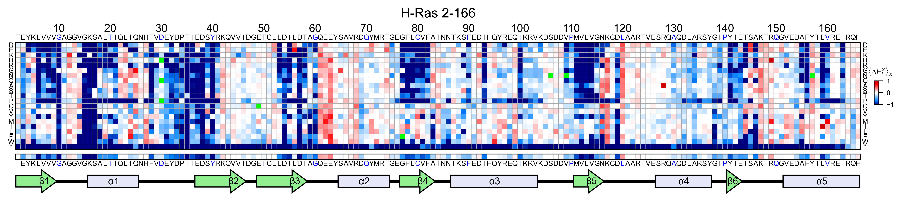
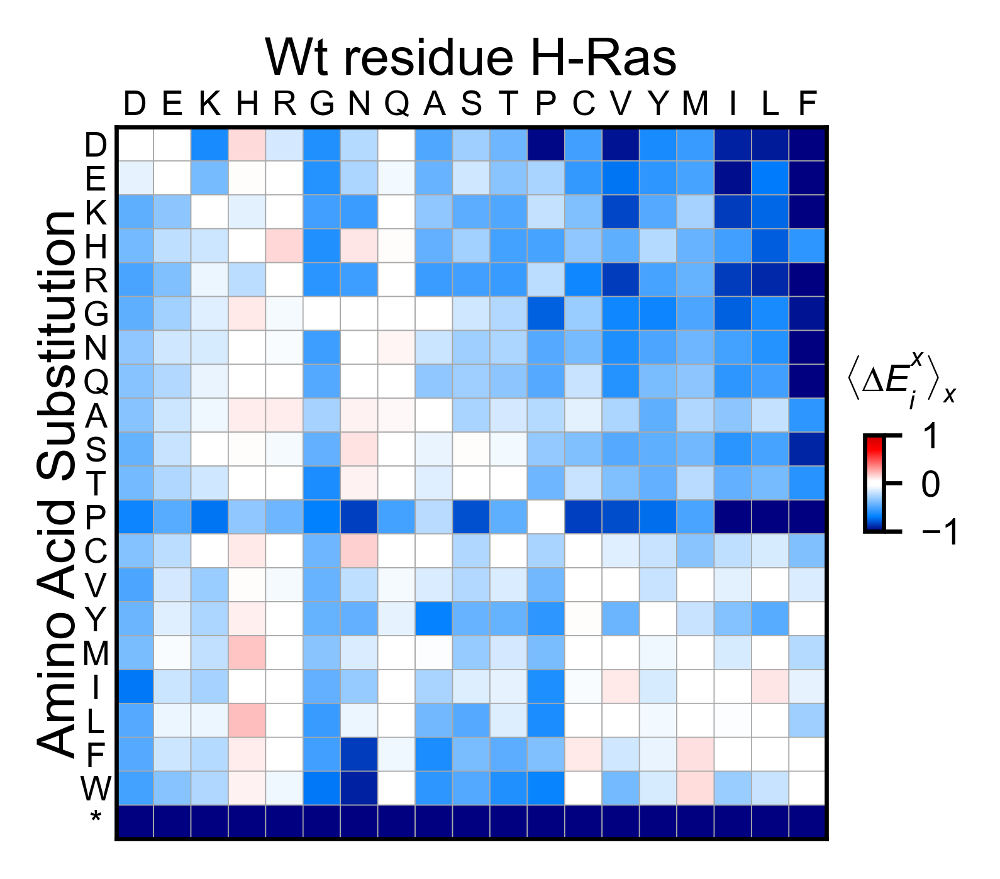
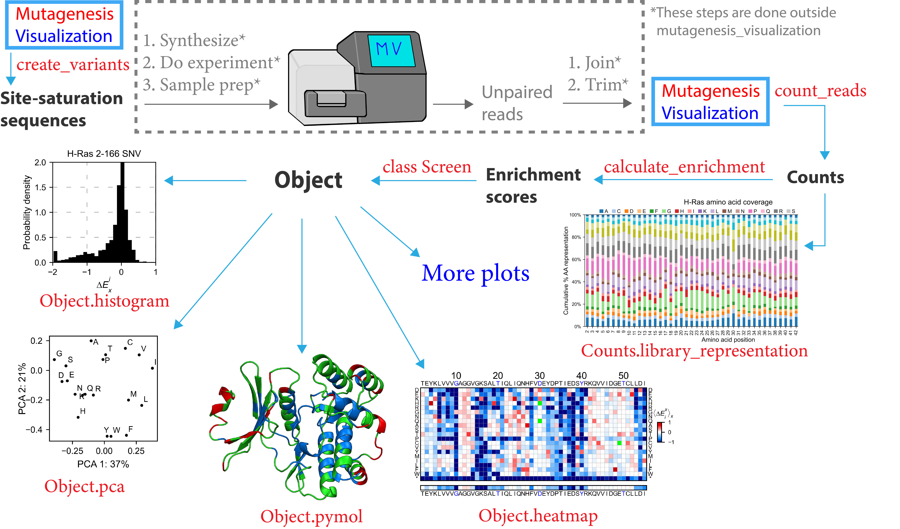

.. role:: py(code)
      :language: python

.. role:: bash(code)
      :language: bash

Installation guide
********************

Using a virtual environment
============================

The easiest way to run mutagenesis_visualization is by creating a virtual environment, where all the dependencies are installed from scratch. That will avoid errors related to different versions of dependencies.
There are different tools to manage virtual environments, such as `poetry <https://python-poetry.org/>`_ or `conda <https://docs.conda.io/en/latest/>`_. We recommend using poetry for its simplicity. A toml, a requirements.txt, and a lock files are present in the repository. Anaconda offers the option to create a virtual environment. Check this `guide <https://medium.com/swlh/setting-up-a-conda-environment-in-less-than-5-minutes-e64d8fc338e4>`_ to know how.

Installing with pip
====================

``mutagenesis_visualization`` is compatible with Python =>3.8. The code is available on `GitHub <https://github.com/fhidalgor/mutagenesis_visualization>`_ under a GNU GENERAL PUBLIC LICENSE. The package can be installed from `PyPI <https://pypi.org/project/mutagenesis-visualization>`_ using the ``pip`` package manager by executing the following at the command line:

.. code-block:: bash

     pip install mutagenesis_visualization

.. note::
    The package folder is called "mutagenesis_visualization" (with underscore), but pip replaces the underscore with a hyphen. Thus, if you search for it on Pypi, it will show up as "mutagenesis-visualization". For installation purposes, both a hyphen and an underscore work.

Installing from github
=======================

Execute the following command to install the library from Github:

.. code:: ipython3

	pip install git+https://github.com/fhidalgor/mutagenesis_visualization

Dependencies
==============

In this section I am listing the dependencies and the versions I used to make the package.
Check out the requirements.txt and the pyproject.toml files to see the specific versions that were used.

.. note::
    The software has been tested on Linux, Windows and MacOS platforms. The package works in all of them as long as the dependencies are updated. We have encountered issues when the Anaconda environment was old. Those issues got solved by uninstalling and reinstalling Anaconda (which will automatically update all the dependencies.)

Required Dependencies
-----------------------
- python (version >= 3.8)

- `numpy <http://numpy.org/>`_

- `matplotlib <http://matplotlib.org/>`_

- `seaborn <https://seaborn.pydata.org/>`_

- `pandas <http://pandas.pydata.org/>`_

- `scipy <http://www.scipy.org/scipylib/index.html>`_

- `scikit-learn <http://scikit-learn.org/stable/>`_

- `biopython <https://pypi.org/project/biopython/>`_

- `freesasa <https://pypi.org/project/freesasa/>`_

- `adjustText <https://pypi.org/project/adjustText/>`_

- `plotly <https://plotly.com/>`_

- `openpyxl <https://pypi.org/project/openpyxl/>`_

- `ipympl <https://pypi.org/project/ipympl/>`_

- `xlrd <https://pypi.org/project/xlrd/>`_

- `statsmodels <https://pypi.org/project/statsmodels/>`_

- `xlsxwriter <https://pypi.org/project/XlsxWriter/>`_

More updated versions probably work too. In here, we have specified the versions we used when building the software.

If you want to manually install and/or upgrade the dependencies on your own, use:

.. code:: ipython3

	pip install --upgrade package_name

Optional dependencies
---------------------
- `ipymol <https://github.com/cxhernandez/ipymol>`_ (version 0.5)

``Ipymol`` needs to be installed from Github, since the current Pypi version does not work. Make sure that you have a ``setuptools`` version below 58.0, otherwise there will be an error. To install ipymol, use this command:

.. code:: ipython3

	pip install git+https://github.com/cxhernandez/ipymol

You may have already installed ``Pymol``. However, if it is not on the same path as Python, there will not be communication between the two. An easy way to circumvent the problem is to reinstall ``Pymol`` using the following command:

.. code:: ipython3

	conda install -c schrodinger pymol-bundle
	
If you create a virtual environment with conda, you need to install the pymol bundle in the virtual environment.

Quick demo
********************

Now that you have installed ``mutagenesis_visualization``, execute the following within Python to evaluate whether it is working propertly:

.. code:: ipython3

	import mutagenesis_visualization as mut
	mut.run_demo()

This command will load the ``mutagenesis_visualization`` package, create a ``Screen`` object with sample data, call the ``object.heatmap`` method and show a heatmap plot of the sample data.

There are four other demo plots, and can be invoked using the following command:

.. code:: ipython3

	mut.run_demo(figure = 'mean')
	mut.run_demo(figure = 'miniheatmap')
	mut.run_demo(figure = 'kernel')
	mut.run_demo(figure = 'pca')

.. image:: images/exported_images/hras_bar_mean.png
   :width: 500px
   :align: center

.. image:: images/exported_images/hras_pcaaminoacid.png
   :width: 200px

.. image:: images/exported_images/hras_kde.png
   :width: 240px

Run `mut.run_demo(figure = 'pymol')` to test if your Pymol is connected to this package.

If you would like to play with the data yourself, execute the following command to retrieve the raw data:

.. code:: ipython3

	datasets = mut.load_demo_datasets()

A more detailed explanation on how to generate these figures can be seen at :ref:`Creating plots` and at :ref:`Other datasets`.

Workflow
********************

Let's take a look to the workflow of this software:

Mutagenesis_visualization will simplify the process of developing and analyzing mutagenesis experiments. To start, you can use this software to design site-saturation sequences using the create_variants function. From here, you will pause your work with Mutagenesis_visualization to synthesize the site-saturation sequences using Twist Bio, Agilent, etc. Once you have got your DNA library ready, you will perform the necessary experiments and sequence the samples. After that, you will use a bioinformatics software (ie Flash) to pair the unpaired reads. Then you will trim the adapters to generate FASTQ files.

Now you will return to the software to conduct analysis of your experiment. Mutagenesis_visualization will read the FASTQ files and return the counts per variant. At this point, there are a few visualization plots that you can create in order to assess the quality of the DNA library. After that, you will calculate the enrichment scores using the calculate_enrichment function (you will need a pre-selection and a post-selection dataset). With the enrichment scores in hand, you can use the Screen class to generate several different plots, including heatmaps, histograms, scatter plots, PCA analysis, Pymol figures, and more.
