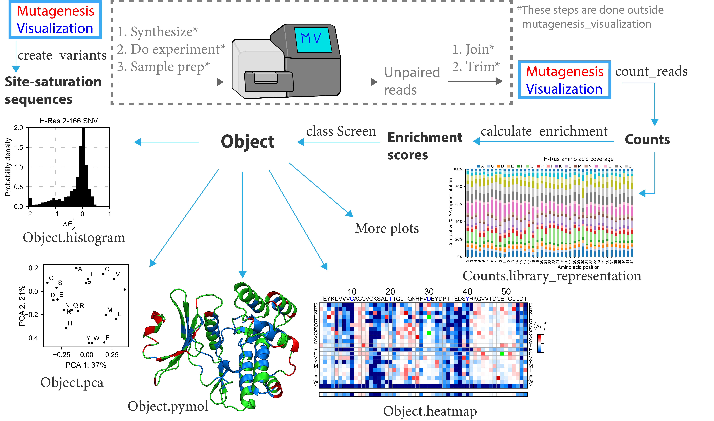

.. role:: py(code)
      :language: python

.. role:: bash(code)
      :language: bash
	  
	  
Installation guide
********************

Installing with pip
====================

``mutagenesis_visualization`` is compatible with Python 3.6. The code is available on `GitHub <https://github.com/fhidalgor/mutagenesis_visualization>`_ under a GNU GENERAL PUBLIC LICENSE. The package can be installed from `PyPI <https://pypi.org/project/mutagenesis-visualization>`_ using the ``pip`` package manager by executing the following at the command line:

.. code-block:: bash

     pip install mutagenesis_visualization

If you are working on a jupyter notebook, you may have to use the following command:

.. code:: ipython3

    import sys
    !{sys.executable} -m pip install mutagenesis_visualization

.. note::
    The package folder is called "mutagenesis_visualization" (with underscore), but pip replaces the underscore with a hyphen. Thus, if you search for it on Pypi, it will show up as "mutagenesis-visualization". For installation purposes, both a hyphen and an underscore work.
    
Installing from github
=======================

Execute the following command to install the library from Github:

.. code:: ipython3

	pip install git+https://github.com/fhidalgor/mutagenesis_visualization

Use mutagenesis_visualization locally 
=======================================

.. note::
    Skip this section if you pip installed the package.
    
You may decide to download the jupyter notebook called ``mutagenesis_visualization.ipynb`` also found on GitHub, which contains the code used in this package, and do some modifications of your own. If you do so, there is an easy way to use that same notebook without having to convert it every time to a .py file. Download the folder ``jupyter_notebooks`` and place your current notebook in that folder. The run the command shown below. Should you go through this route, you will need to manually install the required :ref:`dependencies`.

.. code:: ipython3

    import Import_notebook
    import mutagenesis_visualization as mut	

Dependencies
==============

In this section I am listing the dependencies and the versions I used to make the package.
 
.. note::
    The software has been tested on Linux, Windows and MacOS platforms. The package works in all of them as long as the dependencies are updated. We have encountered issues when the Anaconda environment was old. Those issues got solved by uninstalling and reinstalling Anaconda (which will automatically update all the dependencies.)
 
Required Dependencies
-----------------------
- `numpy <http://numpy.org/>`_ (version 1.18.5)

- `matplotlib <http://matplotlib.org/>`_ (version 3.2.2)

- `seaborn <https://seaborn.pydata.org/>`_ (version 0.10.1)

- `pandas <http://pandas.pydata.org/>`_ (version 1.0.5)

- `scipy <http://www.scipy.org/scipylib/index.html>`_ (version 1.5.0)

- `scikit-learn <http://scikit-learn.org/stable/>`_ (version 0.23.1)

- `copy <https://docs.python.org/2/library/copy.html>`_ 

- `itertools <https://docs.python.org/3/library/itertools.html>`_ (version 8.4.0)

- `biopython <https://pypi.org/project/biopython/>`_ (version 1.77)

- `collections <https://docs.python.org/2/library/collections.html>`_ (version 1.2.1)

- `freesasa <https://pypi.org/project/freesasa/>`_ (version 2.1.0)

- `logomaker <https://logomaker.readthedocs.io>`_ (version 0.8)

- `adjustText <https://pypi.org/project/adjustText/>`_ (version 0.7.3)

- `plotly <https://plotly.com/>`_ (version 4.11.0)

If you want to manually install and/or upgrade the dependencies on your own, use:

.. code:: ipython3

	pip install --upgrade package_name
	

Optional dependencies
---------------------
- `ipymol <https://github.com/cxhernandez/ipymol>`_ (version 0.5)
    

``Ipymol`` needs to be installed from Github, since the current Pypi version does not work. To install use this command:

.. code:: ipython3

	pip install git+https://github.com/cxhernandez/ipymol

	
You may have already installed ``Pymol``. However, if it is not on the same path as Python, there will not be communication between the two. An easy way to circumvent the problem is to reinstall ``Pymol`` using the following command:

.. code:: ipython3

	conda install -c schrodinger pymol-bundle

Quick demo
********************

Now that you have installed ``mutagenesis_visualization``, execute the following within Python to evaluate whether it is working propertly:

.. code:: ipython3

	import mutagenesis_visualization as mut
	mut.demo()

This command will load the ``mutagenesis_visualization`` package, create a ``Screen.object`` with sample data, call the ``object.heatmap`` method and show a heatmap plot of the sample data.

.. image:: images/exported_images/hras_fullheatmap.png

There are four other demo plots, and can be invoked using the following command:

.. code:: ipython3

	mut.demo(figure = 'mean')
	mut.demo(figure = 'miniheatmap')
	mut.demo(figure = 'kernel')
	mut.demo(figure = 'pca')

.. image:: images/exported_images/hras_bar_mean.png
   :width: 500px
   :align: center
   
.. image:: images/exported_images/hras_miniheatmap.png
   :width: 200px
   :align: center
   
.. image:: images/exported_images/hras_pcaaminoacid.png
   :width: 200px
     
.. image:: images/exported_images/hras_kde.png
   :width: 240px

If you would like to play with the data yourself, execute the following command to retrieve the raw data:

.. code:: ipython3

	datasets = mut.demo_datasets()
	
	
A more detailed explanation on how to generate these figures can be seen at :ref:`Creating plots` and at :ref:`Holistic testing`.

Workflow
********************

Let's take a look to the workflow of this software:

   
Mutagenesis_visualization will simplify the process of developing and analyzing mutagenesis experiments. To start, you can use this software to design site-saturation sequences using the create_variants function. From here, you will pause your work with Mutagenesis_visualization to synthesize the site-saturation sequences using Twist Bio, Agilent, etc. Once you have got your DNA library ready, you will perform the necessary experiments and sequence the samples. After that, you will use a bioinformatics software (ie Flash) to pair the unpaired reads. Then you will trim the adapters to generate FASTQ files.

Now you will return to the software to conduct analysis of your experiment. Mutagenesis_visualization will read the FASTQ files and return the counts per variant. At this point, there are a few visualization plots that you can create in order to assess the quality of the DNA library. After that, you will calculate the enrichment scores using the calculate_enrichment function (you will need a pre-selection and a post-selection dataset). With the enrichment scores in hand, you can use the Screen class to generate several different plots, including heatmaps, histograms, scatter plots, PCA analysis, Pymol figures, and more.