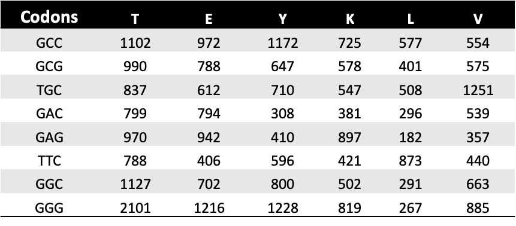
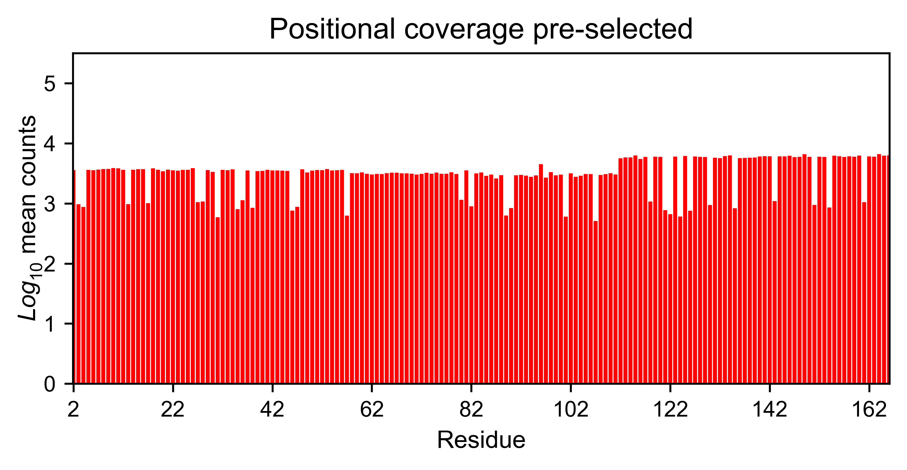
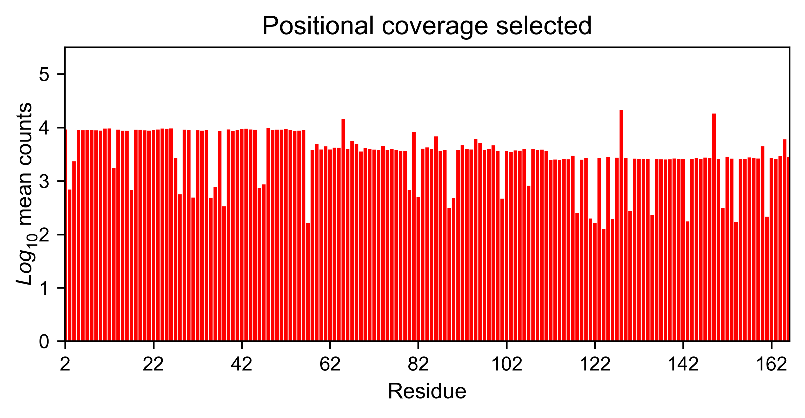

Processing
==========

This section will teach you how to use the built-in processing
functions. If you already have your own processing pipeline built, you
can skip this section and go to the plotting examples.

Import module
-------------

.. code:: ipython3

    import Import_notebook
    import mutagenesis_visualization as mut
    import numpy as np
    import pandas as pd

Count DNA reads from fastq file
-------------------------------

After sequencing your DNA library, you will assemble the forward and
reverse reads and trim the flanking bases (using other packages). That
will produce a trimmed fastq file. The following function
``count_reads`` will read your trimmed fastq file and count the number
of times a DNA sequence is present. You will have to pass as inputs a
``dna_sequence`` and a ``codon_list`` with the codons that were used to
make the point mutant library. If ``savefile`` is set to True, it will
export the results to txt files (see below prettified output counts
table)

.. code:: ipython3

    # Paths and filenames
    inputfilepath = 'Trimmed/'
    inputfilename_pre = 'hras.fastq'
    outputfilepath = 'codonCounts/'
    outputfilename_pre = 'hras_counts'
    
    # H-Ras dna sequence
    hras_dnasequence = 'acggaatataagctggtggtggtgggcgccggcggtgtgggcaagagtgcgctgaccatccagctgatccagaaccattttgtggacgaatacgaccccactatagaggattcctaccggaagcaggtggtcattgatggggagacgtgcctgttggacatcctg'
    
    # Codons used to make the NNS library. I could also have used 'NNS' and the package will use the NNS codons
    codon_list = ["GCC", "GCG", "TGC", "GAC", "GAG", "TTC", "GGC", "GGG", "CAC", "ATC", "AAG", "CTC", "CTG", "TTG", "ATG",
                  "AAC", "CCC", "CCG", "CAG", "CGC", "CGG", "AGG", "TCC", "TCG", "AGC", "ACC", "ACG", "GTC", "GTG", "TGG", "TAC", "TAG"]
    
    df_counts_pre, wt_counts_pre = mut.count_reads(hras_dnasequence, codon_list, inputfilepath, inputfilename_pre,
                               outputfilepath, outputfilename_pre, savefile=False)
    

Once the reads have been counted, the function ``plot_counts`` can be
used to evaluate the coverage by position. You can also manually inspect
the exported files.

.. code:: ipython3

    # Read counts from file (could be txt, csv, xlsx, etc...)
    df_counts_pre = pd.read_excel('mutagenesis_visualization_package/example/hrasGAPGEF_counts.xlsx',
                             'R1_before', skiprows=1, index_col='Codons', usecols='E:FN', nrows = 32)
    
    df_counts_sel = pd.read_excel('mutagenesis_visualization_package/example/hrasGAPGEF_counts.xlsx',
                             'R1_after', skiprows=1, index_col='Codons', usecols='E:FN', nrows = 32)
    
    # Determine the positions (x axis)
    positions = np.arange(2,167,1)
    
    # Plot mean counts
    hras_RBD.meancounts(positions, df_counts_pre.mean(), show_cartoon=False, 
                    yscale = (0,5.5), figsize = (6,2.5), title = 'Positional coverage pre-selected',
                       outputfilename='hras_countspre', outputfilepath=outputfilepath, savefile=savefile)
    
    hras_RBD.meancounts(positions, df_counts_sel.mean(), show_cartoon=False, 
                    yscale = (0,5.5), figsize = (6,2.5), title = 'Positional coverage selected',
                    outputfilename='hras_countssel', outputfilepath=outputfilepath, savefile=savefile)

        

Calculate enrichment scores
---------------------------

The input and ouput counts files are used to calculate the enrichment
score using ``calculate_enrichment``. This function allows for different
parameters to tune how the data is processed and normalized. In our own
research projects, we have determined that the combination of parameters
that works best for us it to the wild-type synonymous sequences to do a
first data normalization step. Then use ``zeroing = 'kernel'`` to zero
the data and use ``stopcodon=True`` in order to determine the baseline
level of signal. You may need to use different parameters for your
purposes. If the library was divided into multiple pools, it is better
to calculate the enrichment scores for every pools separately and then
concatenate them.

.. code:: ipython3

    # Assign variables
    pre_lib = df_counts_pre
    post_lib = df_counts_sel
    
    # Order of amino acids (from count_reads)
    aminoacids_NNS = list('AACDEFGGHIKLLLMNPPQRRRSSSTTVVWY*')
    
    # Parameters to save output images, will be the same for each plot
    outputfilepath = 'mutagenesis_visualization_package/example/exported_images/'
    savefile = True
    
    # Different parameters can be used to calculate the enrichment scores. They are described in the implementation section
    
    # Zeroing using the median of the population, and not using stop codons to correct.
    frequencies = mut.calculate_enrichment(pre_lib, post_lib, aminoacids=aminoacids_NNS,
                                           zeroing='population', how='median', norm_std=True,
                                           stopcodon=True, mn_counts=25, min_countswt=100,
                                           mpop=2, mwt=2, infinite=3, std_scale=0.3)
    
    hras_example1 = mut.Screen(np.array(frequencies), hras_sequence,
                               aminoacids, start_position, fillna, secondary)
    
    hras_example1.heatmap(title='Normal distribution zeroing', outputfilename='hras_zeronormal', 
                          outputfilepath=outputfilepath, outputformat=outputformat, savefile=savefile)
    
    # Zeroing using the median of the population, and not using stop codons to correct.
    frequencies = mut.calculate_enrichment(pre_lib, post_lib, aminoacids=aminoacids_NNS,
                                           zeroing='kernel', how='median', norm_std=True,
                                           stopcodon=True, mn_counts=25, min_countswt=100,
                                           mpop=2, mwt=2, infinite=3, std_scale=0.15)
    
    hras_example2 = mut.Screen(np.array(frequencies), hras_sequence,
                               aminoacids, start_position, fillna, secondary)
    
    hras_example2.heatmap(title='KDE zeroing', outputfilename='hras_zerokernel', 
                          outputfilepath=outputfilepath, outputformat=outputformat, savefile=savefile)
    
    # Note that the two heatmaps look quite similar but the red tonality is slighly different. That is caused by
    # small differences in zeroing the data.

.. image:: ../example/exported_images/hras_tableenrichment.png
   :width: 300px
   :align: center

.. image:: ../example/exported_images/hras_zeronormal.png
   :width: 300px
   :align: center

.. image:: ../example/exported_images/hras_zerokernel.png
   :width: 300px
   :align: center

Combine MSA with enrichment scores
----------------------------------

Function ``msa_enrichment`` will calculate the frequency of each
substitution in an input MSA. The frequency of each substitution will be
merged into the enrichment score dataframe. The function also calculates
the Shannon entropy for each position in the protein. This function has
been used to generate the data that is plotted in box plot and the ROC
AUC charts. We will first need to create the object.

.. code:: ipython3

    # Load enrichment scores
    hras_enrichment_RBD = np.genfromtxt('Exported/HRas166_RBD.csv', delimiter=',')
    
    # Define protein sequence
    hras_sequence = 'MTEYKLVVVGAGGVGKSALTIQLIQNHFVDEYDPTIEDSYRKQVVIDGETCLLDILDTAGQEEYSAMRDQYMRTGEGFLCVFAINNTKSFEDIHQYREQIKRVKDSDDVPMVLVGNKCDLAARTVESRQAQDLARSYGIPYIETSAKTRQGVEDAFYTLVREIRQHKLRKLNPPDESGPG'
    
    # Create object (more detail about this in plotting examples)
    hras_RBD = mut.Screen(hras_enrichment_RBD, hras_sequence)

Now we can get the frequency of each substituion in the MSA and the
Shannon entropy.

.. code:: ipython3

    # Calculate conservation score from MSA
    path = 'Other/2020_pfam/Ras_family_trimmed.fasta'
    df_shannon, df_freq = mut.msa_enrichment(hras_RBD, path, start_position=1, threshold=0.1)
    
    # In the example, for position 2, in 3.63% of the cases there was an Ala.
    df_freq.head(5)

.. image:: ../example/exported_images/hras_table_msa.png
   :width: 300px
   :align: center
