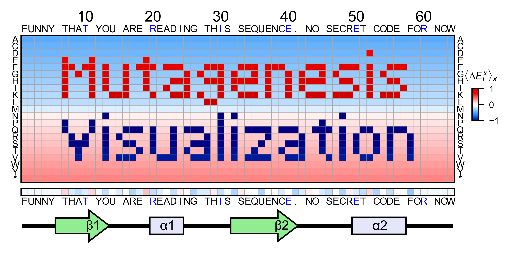
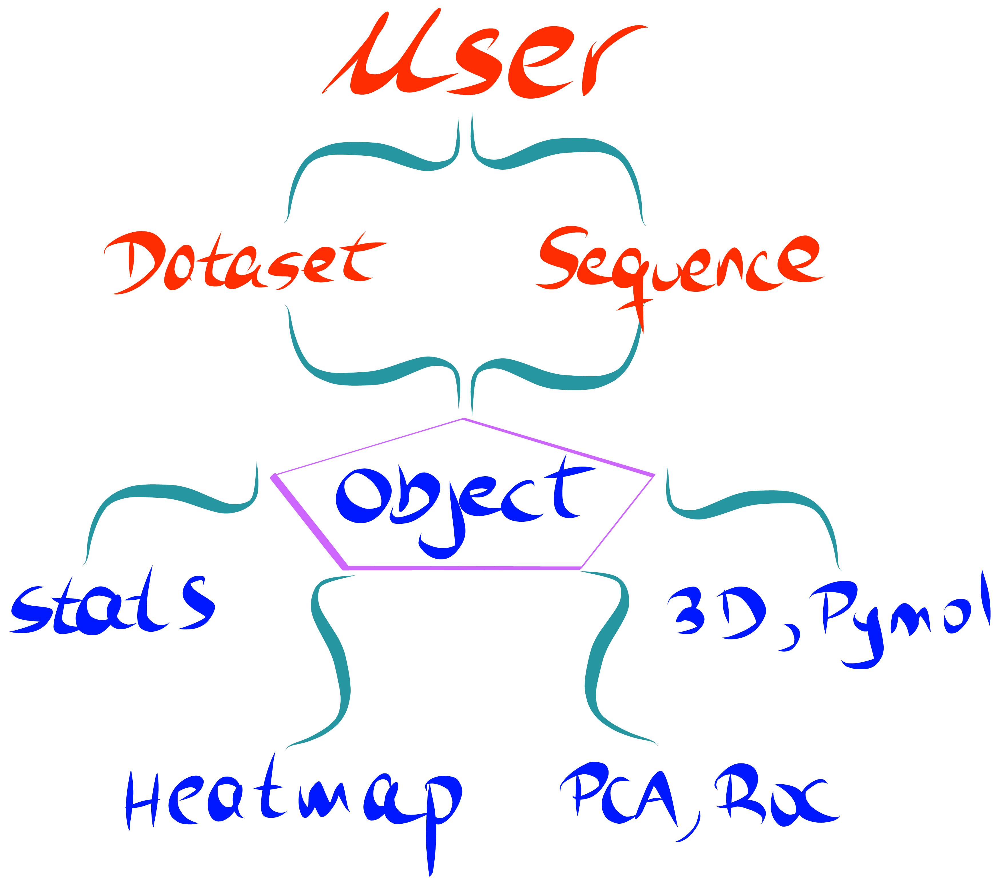

Description
=============

``mutagenesis_visualization`` is a Python package aimed to generate publication-quality figures for saturation mutagenesis datasets.

The package main focus is to perform the statistical analysis and visualization steps of your pipeline, but it additionally offers tools to calculate enrichment scores from fastq files.

Unlike other available python packages, we have developed a user-centered API which does not require prior experience with Python nor statistics. The documentation provides multiple examples of how to perform each step. As the user, you will be guided to input your dataset and the protein sequence. From here, the software *prend le contrôle*, and will produce a wide range of stunning and detailed plots. 

Key Features
=============

	- Calculate enrichment scores from fastq files, allowing for different ways of data processing and normalization.
	- Produce publication-quality heatmaps from enrichment scores as well as a wide range of visualization plots.
	- Principal component analysis (PCA), hierarchical clustering and receiver operating characteristic (ROC) curve tools.
	- Map enrichment scores effortlessly onto a PDB structure using Pymol. Structural properties such as SASA, B-factor or atom coordinates can be extracted from the PDB and visualized using a built-in method.
	- Generate dashboards.